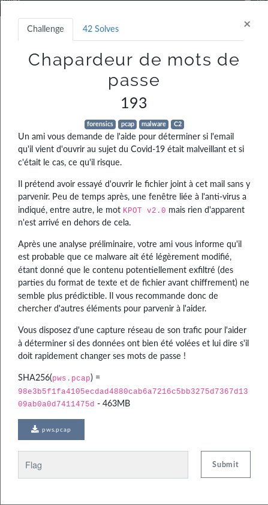
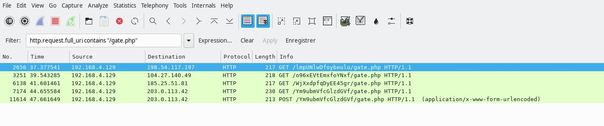
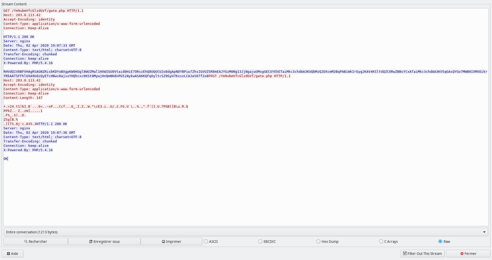
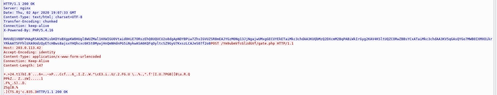

# Forensic - Chapardeur de mots de passe
  
Pendant que "pws.pcap" se télécharge, on peut s'informer sur "KPOT v2.0".  
On apprend que c'est un malware qui récupère des données stockées sur l'ordinateur de la victime.  
On tombe sur [cet article](https://www.proofpoint.com/us/threat-insight/post/new-kpot-v20-stealer-brings-zero-persistence-and-memory-features-silently-steal) qui nous explique comment le malware exfiltre les données qu'il a récupéré et comment analyser ces données.  
On apprend que la victime communique avec le serveur de Command & Control en HTTP. La première requête est un GET sur /\<random>/gate.php, le serveur renvoie une chaine encodée en base64 et xoré avec une clé.  
  
C'est le moment d'ouvrir notre "pws.pcap" dans Wireshark.  
On peut utiliser le filtre ``http.request.full_uri contains "/gate.php"`` comme on sait que la victime communique avec le serveur de C&C en HTTP et que la première requête est un GET sur /\<random>/gate.php.  
  
On obtient quelques requêtes GET mais celle sur l'IP 203.0.113.42 est suivie d'un POST sur la même IP. On va donc s'intéresser à cet échange : ``Clic droit sur le POST > Follow HTTP Stream``  
  
On retrouve des requêtes similaires à celles qu'il y a sur l'article.  
  
En revanche, nous ne connaissons pas la clé pour déchiffrer les informations mais l'article nous donne un exemple de la réponse du serveur une fois décodée et déchiffrée : ```1111111111111100__DELIMM__A.B.C.D__DELIMM__appdata__GRABBER__*.log,*.txt,  __GRABBER__%appdata%__GRABBER__0__GRABBER__1024__DELIMM__desktop_txt__GRABBER__*.txt,  __GRABBER__%userprofile%\Desktop__GRABBER__0__GRABBER__150__DELIMM____DELIMM____DELIMM__```  
On a également un exemple de clé : ```4p81GSwBwRrAhCYK``` (on peut en déduire que notre clé fera 16 caractères également)  
  
Avec toutes ces informations, on est en capacité de déduire notre clé. J'ai donc fais un petit programme en python :  
```python
def getKey(data_enc):
    string_example = "1111111111111100"
    key = ""
    idx = 0
    while len(key) < 16:
        for i in range(256):
            if (ord(data_enc[idx]) ^ i) == ord(string_example[idx]):
                key += chr(i)
                idx += 1
                break
    return key

data_enc_get = open("data.enc").read()
key = getKey(data_enc_get)
print(key)
```  
Le fichier "data.enc" contient les données décodées que l'on a trouvé encodées en base64 dans la réponse du serveur :  
```bash
echo "RHVdQ1V8BFVHAgRSAGNZRisbKDYoBXgpKW0HUgl8WUZMal1HXWIGU0Vtaid0HiE7ORszEhQ8UQUCU2o8dgApNDYBPiw7ZhsIGVUZSR8mEAJYGzM0Ng13JjNgajwUMxgGECUYEkETaiMkc3chdAA3KUQbMzQ2DXcmM2BqPABiWkIrGyg2KAV4KSltUQZCORwZBBsYCxATaiMkc3chdAA3KV5qGAsQYGo7MWB0IXMXOikrYRkAAT5FFhlUXA9UdzQyETcHBws8ajsxYHQhcxc6KSt0MywjHnQmNHdnPG5iNykwASA6KQFqOyltcSZ9GyU7KxszLCAJeS07f2o8" | base64 -d > data.enc
```  
  
La sortie du programme python :  
```
uDlrdM5dv35c1Riv
```  
  
Super ! On a notre clé. On vérifie si elle est correct en déchiffrant "data.enc" :  
```python
def decryptData(data, key):
    m = ""
    for i in range(len(data)):
        m += chr(ord(data[i]) ^ ord(key[i%len(key)]))
    return m

data_enc_get = open("data.enc").read()
print(decryptData(data_enc_get, "uDlrdM5dv35c1Riv"))
```  
La sortie du programme python :  
```
1111111111111100^_DDLHMM_^218.009.159/373^_DELHML__`pqdat`__GR@BCER^_+.lof,*.tyt-__FRGBBES__%aqpeat`%^_GR@BBER^_1__FRGBBES__1034^_DDLHMM_^deskuoq_tyt^_GR@BBER^_+.tyt-__GSABBES_^%uresprogile%]Ddskuoq__GSABBES_^0_^GSABBDR__0^_EELHML___^DELILM^__^DDLIML__
```  
Mince, pas très lisible tout ça. Mais en regardant sur l'article, on remarque quand même des similitudes.  
Pour générer notre clé, on se sert du début de la réponse du serveur qu'il y a dans l'exemple sur l'article : "1111111111111100" mais ces chiffres sont sûrement différent pour notre cas. On essaie d'arranger cette chaine pour retrouver "\_\_DELIMM\_\_" et "\_\_GRABBER\_\_" comme sur l'article. Avec "0110101110111110" ca semble un peu plus clair : 
```python
def getKey(data_enc):
    string_example = "0110101110111110"
    key = ""
    idx = 0
    while len(key) < 16:
        for i in range(256):
            if (ord(data_enc[idx]) ^ i) == ord(string_example[idx]):
                key += chr(i)
                idx += 1
                break
    return key

def decryptData(data, key):
    m = ""
    for i in range(len(data)):
        m += chr(ord(data[i]) ^ ord(key[i%len(key)]))
    return m

data_enc_get = open("data.enc").read()
key = getKey(data_enc_get)
print("clé :", key)
print(decryptData(data_enc_get, key))
```  
La sortie du programme python :  
```
clé : tDlsdL5dv25c1Rhv
0110101110111110__DELIMM__218.108.149.373__DELIMM__appdata__GRABBER__*.log,*.txt,__GRFBBER__%appdata%__GRABBER__0__GRFBBER__1024__DELIMM__desktop_txt__GRABBER__*.txt,__GRABBER__%userprofile%\Desktop__GRABBER__0__GRABBER__0__DELIMM____DELIMM____DELIMM__
```  
  
On est presqu'à la fin, on déchiffre ce qui a été envoyé par le client dans l'autre requête (c'est-à-dire la requête en rouge).  
  
  
Pour récupérer les données chiffrées, on retourne sur Wireshark, on clique sur "C Arrays" en bas à droite et on prend le contenu de ``peer0_2`` :  
```c
char peer0_2[] = {
0x2b, 0x00, 0x3e, 0x32, 0x34, 0x09, 0x74, 0x31, 
0x29, 0x62, 0x49, 0x16, 0x42, 0x60, 0x18, 0x13, 
0x01, 0x36, 0x3d, 0x06, 0x01, 0x7e, 0x78, 0x50, 
0x1a, 0x13, 0x15, 0x43, 0x63, 0x66, 0x1b, 0x05, 
0x01, 0x36, 0x5f, 0x09, 0x49, 0x1a, 0x5a, 0x10, 
0x04, 0x57, 0x18, 0x22, 0x5c, 0x63, 0x45, 0x33, 
0x00, 0x69, 0x1a, 0x1c, 0x55, 0x2f, 0x04, 0x32, 
0x19, 0x46, 0x47, 0x06, 0x55, 0x20, 0x5c, 0x06, 
0x11, 0x25, 0x19, 0x2c, 0x22, 0x0f, 0x66, 0x27, 
0x7c, 0x49, 0x01, 0x55, 0x08, 0x37, 0x50, 0x47, 
0x42, 0x7c, 0x5b, 0x42, 0x5c, 0x75, 0x0c, 0x52, 
0x13, 0x51, 0x0d, 0x50, 0x50, 0x6b, 0x5a, 0x17, 
0x17, 0x20, 0x5a, 0x15, 0x01, 0x7a, 0x57, 0x5d, 
0x15, 0x02, 0x06, 0x00, 0x07, 0x31, 0x0d, 0x12, 
0x46, 0x25, 0x5f, 0x12, 0x53, 0x29, 0x02, 0x05, 
0x44, 0x02, 0x0d, 0x5a, 0x53, 0x67, 0x5b, 0x42, 
0x16, 0x25, 0x0d, 0x16, 0x5d, 0x7b, 0x54, 0x53, 
0x0b, 0x38, 0x6a, 0x27, 0x63, 0x13, 0x38, 0x33, 
0x35, 0x11, 0x33 };
```  
Avant de le coller dans notre programme python, on prend soin de retirer les accolades, les virgules, les espaces, le point-virgule et de remplacer ``0x`` par ``\x``. Ce qui nous donne :  
```python
data_enc_post = "\x2b\x00\x3e\x32\x34\x09\x74\x31\x29\x62\x49\x16\x42\x60\x18\x13\x01\x36\x3d\x06\x01\x7e\x78\x50\x1a\x13\x15\x43\x63\x66\x1b\x05\x01\x36\x5f\x09\x49\x1a\x5a\x10\x04\x57\x18\x22\x5c\x63\x45\x33\x00\x69\x1a\x1c\x55\x2f\x04\x32\x19\x46\x47\x06\x55\x20\x5c\x06\x11\x25\x19\x2c\x22\x0f\x66\x27\x7c\x49\x01\x55\x08\x37\x50\x47\x42\x7c\x5b\x42\x5c\x75\x0c\x52\x13\x51\x0d\x50\x50\x6b\x5a\x17\x17\x20\x5a\x15\x01\x7a\x57\x5d\x15\x02\x06\x00\x07\x31\x0d\x12\x46\x25\x5f\x12\x53\x29\x02\x05\x44\x02\x0d\x5a\x53\x67\x5b\x42\x16\x25\x0d\x16\x5d\x7b\x54\x53\x0b\x38\x6a\x27\x63\x13\x38\x33\x35\x11\x33"
```  
On le rajoute à la fin de notre programme python et on affiche le résultat une fois déchiffré.  
  
Voici le programme entier :  
```python
def getKey(data_enc):
    string_example = "0110101110111110"
    key = ""
    idx = 0
    while len(key) != 16:
        for i in range(256):
            if (ord(data_enc[idx]) ^ i) == ord(string_example[idx]):
                key += chr(i)
                idx += 1
                break
    return key

def decryptData(data, key):
    m = ""
    for i in range(len(data)):
        m += chr(ord(data[i]) ^ ord(key[i%len(key)]))
    return m

data_enc_get = open("data.enc").read()
key = getKey(data_enc_get)
print("clé :", key)
print(decryptData(data_enc_get, key))

data_enc_post = "\x2b\x00\x3e\x32\x34\x09\x74\x31\x29\x62\x49\x16\x42\x60\x18\x13\x01\x36\x3d\x06\x01\x7e\x78\x50\x1a\x13\x15\x43\x63\x66\x1b\x05\x01\x36\x5f\x09\x49\x1a\x5a\x10\x04\x57\x18\x22\x5c\x63\x45\x33\x00\x69\x1a\x1c\x55\x2f\x04\x32\x19\x46\x47\x06\x55\x20\x5c\x06\x11\x25\x19\x2c\x22\x0f\x66\x27\x7c\x49\x01\x55\x08\x37\x50\x47\x42\x7c\x5b\x42\x5c\x75\x0c\x52\x13\x51\x0d\x50\x50\x6b\x5a\x17\x17\x20\x5a\x15\x01\x7a\x57\x5d\x15\x02\x06\x00\x07\x31\x0d\x12\x46\x25\x5f\x12\x53\x29\x02\x05\x44\x02\x0d\x5a\x53\x67\x5b\x42\x16\x25\x0d\x16\x5d\x7b\x54\x53\x0b\x38\x6a\x27\x63\x13\x38\x33\x35\x11\x33"
print(decryptData(data_enc_post, key))
```  
Et la sortie :  
```
clé : tDlsdL5dv25c1Rhv
0110101110111110__DELIMM__218.108.149.373__DELIMM__appdata__GRABBER__*.log,*.txt,__GRFBBER__%appdata%__GRABBER__0__GRFBBER__1024__DELIMM__desktop_txt__GRABBER__*.txt,__GRABBER__%userprofile%\Desktop__GRABBER__0__GRABBER__0__DELIMM____DELIMM____DELIMM__
_DRAPEAU_P|us2peurQue2M4l!  R4ssur3z-Votre-Am1-Et-vo1c1Votredr4peau_FCSC
{469e8168718996ec83a92acd6fe6b9c03c6ced2a3a7e7a2089b534baae97a7}
_DRAPEAU_
```  
  
**FLAG : FCSC{469e8168718996ec83a92acd6fe6b9c03c6ced2a3a7e7a2089b534baae97a7}**