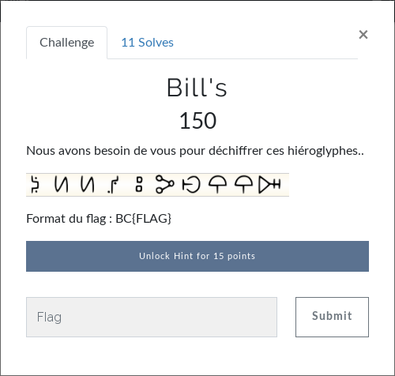

# Crypto - Bill's
  
L'énoncé nous montre des symboles étranges.  
A moins de savoir directement d'où ces symboles proviennent, les premiers indices sont le titre du challenge (Bill's) ainsi que sa catégorie (Crypto).  
On cherche donc "bill's crypto" sur [Google](https://www.google.com/search?q=bill%27s+crypto).  
Ca parle donc de Gravity Falls. On scroll un peu et on arrive sur [dcode.fr](https://www.dcode.fr/gravity-falls-bill-crypto), un petit site bien sympa qui rassemble des outils, solveurs, jeux de lettres, cryptographie, mathématiques, etc, le tout en ligne.  
Puis on fait correspondre chaque symbole à sa lettre et on rajoute le format du flag.  
  
**FLAG : BC{NEEDMYBOOK}**