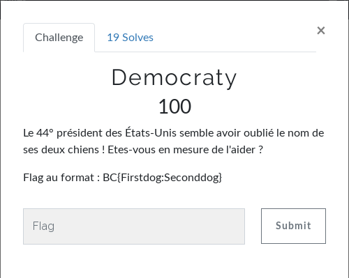

# OSINT - Democraty
Seul challenge d'OSINT du CTF.  
  
Avec une petite recherche, on arrive sur [la page Wikipédia listant les présidents des États-Unis](https://fr.wikipedia.org/wiki/Liste_des_pr%C3%A9sidents_des_%C3%89tats-Unis).  
On apprend que Barack Obama est le 44ème président des États-Unis.  
On cherche ensuite "chiens barack obama" et on tombe sur une page Wikipédia à propos des [animaux domestiques des présidents des États-Unis](https://fr.wikipedia.org/wiki/Barack_Obama).  
`CTRL + F > obama`  
On trouve sur "Bo et Sunny"  
  
**FLAG : BC{Bo:Sunny}**