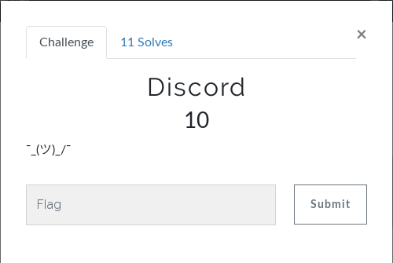
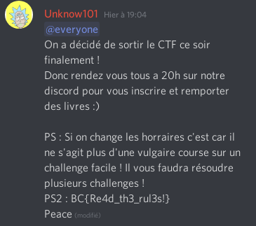

# Misc - Discord
Le chall le plus simple de ce CTF, également celui valant le moins de points.  
  
Comme on s'en doute d'après le titre, il faut avoir rejoint le serveur discord du CTF.  
Ensuite, on recherche les messages contenant "BC{" car tous les flags du CTF étaient sous ce format là.  
On trouve un message de Unknow101 (qui a été modifié) :  
  
  
**FLAG : BC{Re4d_th3_rul3s!}**