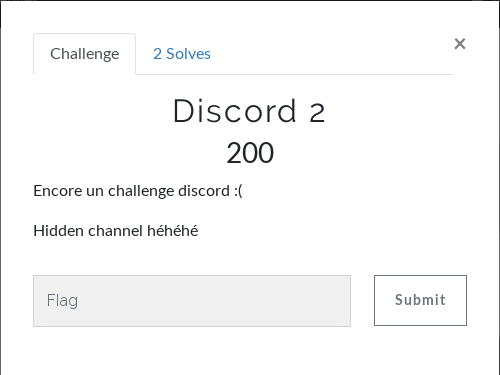
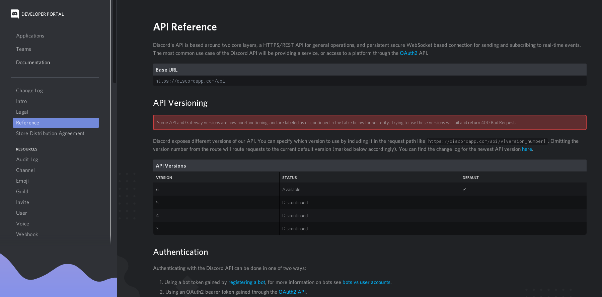
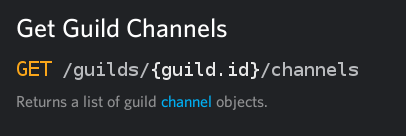
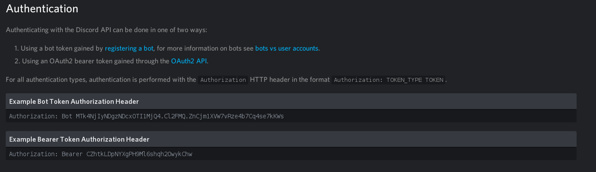

# Misc - Discord 2
  
L'énoncé nous dit que le flag se trouve dans un channel caché, nous ne pouvons donc pas le voir depuis l'appli discord.  
On recherche "show hidden channels discord" et on tombe sur [ce post Reddit](https://www.reddit.com/r/discordapp/comments/7nuqzk/user_can_see_all_hidden_channels_not_access_them/).  
On lit le tout et on remarque un commentaire intéressant :  
```
The way Discord works is that "hidden" channels aren't really hidden from the API side, but rather they're hidden client side.
```
On apprend que les channels peuvent être cachés depuis l'appli mais qu'avec l'api discord nous pouvons toujours les voir, mais pas lire les messages bien évidemment !  
On se rend sur le site officiel de discord, puis "Développeurs > Portail des développeurs". On se connecte.  
On regarde la doc puis on va à l'onglet "Reference".  
  
L'URL de base pour accéder à l'api est : https://discordapp.com/api/v6  
On se rend maintenant dans l'onglet "Guild", car c'est comme cela que les serveurs sont appelés.  
  
On ouvre discord pour récupérer l'id du serveur : Paramètres de l'app discord, puis Apparence et on coche Mode développeur tout en bas. Ensuite on quitte les paramètres et on fait clique droit du l'icone du serveur et tout en bas on a "Copier l'identifiant".  
Une fois fait, on fait notre requête : https://discordapp.com/api/v6/guilds/687358470361710668/channels  
```
{"message": "401: Unauthorized", "code": 0}
```
Bon, ça n'a pas marché.  
Si on se rappelle bien, juste en-dessous de l'url de base pour accéder à l'api, il y a une partie "Authentication".  
  
Il faut donc passer notre token dans le header de notre requête.  
On ne va pas s'embêter, on ouvre discord dans notre navigateur et BurpSuite en parallèle.  
On voit un `GET /api/v6/users/@me/library HTTP/1.1`.  
On l'envoie dans le Repeater : `CTRL + R`  
Et on la modifie par `GET /api/v6/guilds/687358470361710668/channels` puis on lance.  
```
GET /api/v6/guilds/687358470361710668/channels HTTP/1.1
Host: discordapp.com
User-Agent: xxx
Accept: */*
Accept-Language: fr
Accept-Encoding: gzip, deflate
Referer: https://discordapp.com/app
Authorization: xxx
DNT: 1
Connection: close
Cookie: __cfduid=xxx; locale=fr; __cfruid=xxx
```
On regarde la réponse du serveur, une petite recherche avec "BC{" suffit pour trouver le flag.  
  
**FLAG : BC{Put41n_n4sm}**
