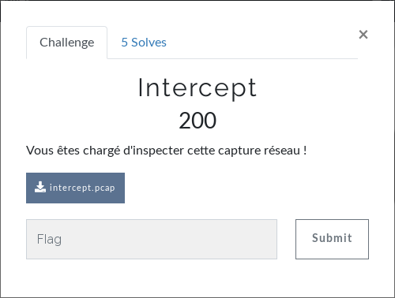
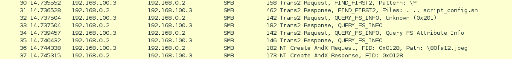
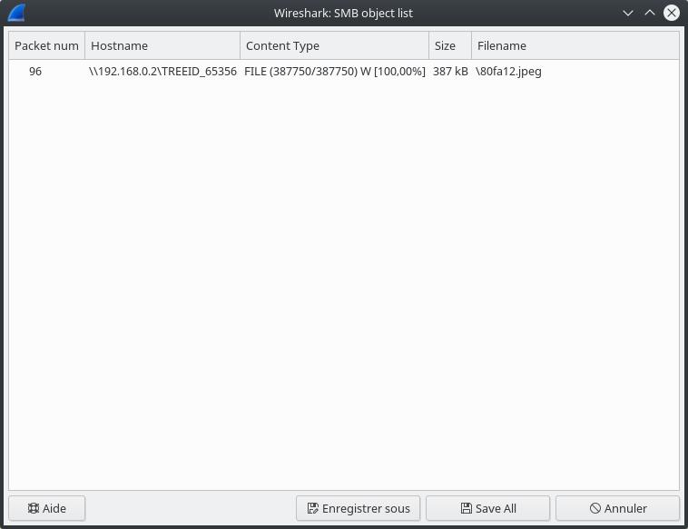

# Forensic - Intercept
Un challenge forensic orienté réseau.  
  
On télécharge la capture réseau puis on l'ouvre dans Wireshark.  
On regardant rapidement, on comprend que la capture a été réalisée lors d'un échange de fichier avec le protocole [SMB](https://fr.wikipedia.org/wiki/Server_Message_Block).  
On remarque 2 noms de fichiers :   
`"script_config.sh" et "\80fa12.jpeg"`  
On souhaite récupérer ces fichiers. On va donc dans le menu `File > Export Objects > SMB`.  
  
Parfait, on enregistre l'image puis on l'affiche.  
  
  
**FLAG : BC{EASY_B0Y}**