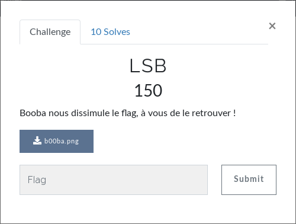
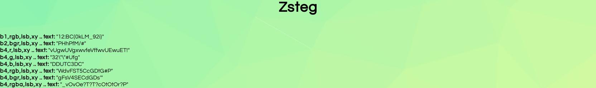

# Stéganographie - LSB
Oh ! De la stégano...  
  
Vu le nom du challenge et la catégorie, on pense directement à ça :  
[https://fr.wikipedia.org/wiki/St%C3%A9ganographie#Usage_des_bits_de_poids_faible_d'une_image](https://fr.wikipedia.org/wiki/St%C3%A9ganographie#Usage_des_bits_de_poids_faible_d'une_image)  
On upload l'image sur [Aperi'solve](https://aperisolve.fr/)  
On patiente quelques secondes et PAF ! Zsteg a trouvé quelque chose :   
  
**FLAG : BC{0kLM_92i}**
