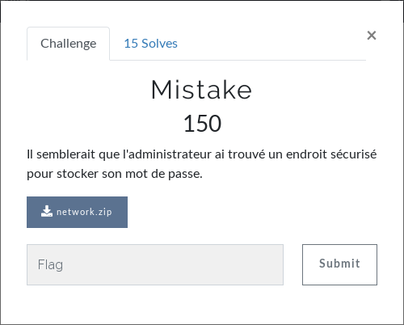
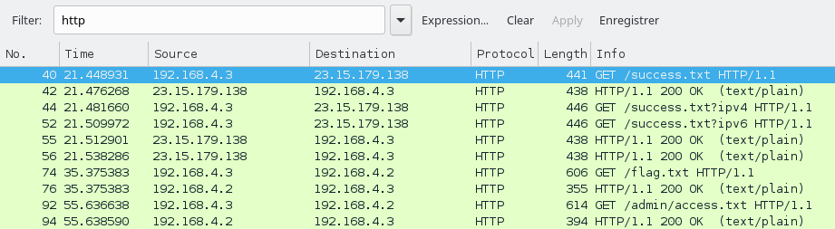

# Network - Mistake
Un chall réseau.  
  
On télécharge le fichier zip. Il contient une capture réseau. On l'ouvre dans Wireshark.  
Il y a plein de requêtes mais on se rend vite compte que seules les requêtes HTTP semblent être intéressantes.  
On filtre donc avec "http".  On se retrouve maintenant avec une dizaine de requêtes à analyser.  
  
Les 6 premières ne nous intéressent pas, ce sont des requêtes envoyées par Firefox.  
On regarde alors dans "GET /flag.txt" et sa réponse.  Rien d'intéressant...  
Il nous reste donc "GET /admin/access.txt". Bingo ! Le flag est dans la réponse du serveur.  
```
Ici c'est safe pour cacher mon pass :)
BC{s3cret_passw0rd}
```
  
**FLAG : BC{s3cret_passw0rd}**