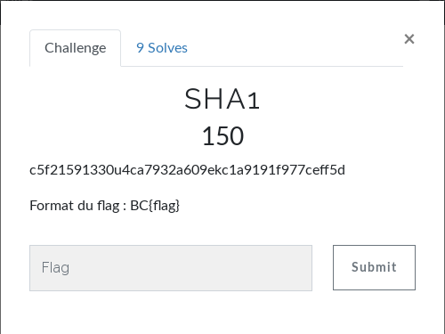

# Crypto - SHA1
  
Rien de bien compliqué, il suffit de rechercher le hash sur Google : [reverse sha-1](https://sha1.gromweb.com/?hash=C5F215913304CA7932A609EC1A9191F977CEFF5D)  
  
**FLAG : BC{passw0rd123}**
