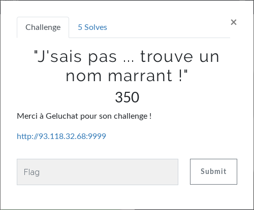
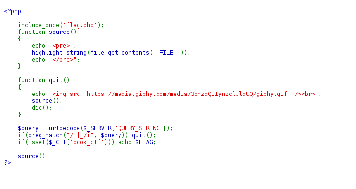
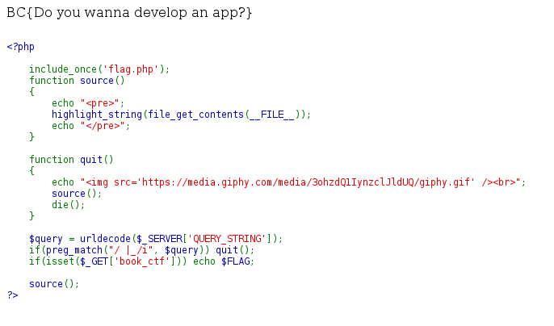

# Web - "J'sais pas ... trouve un nom marrant !"
  
On se rend à l'URL indiqué.  
  
On comprend que pour afficher le flag, il faut que $_GET['book_ctf'] existe.  
En revanche, on ne peut pas simplement rentrer "93.118.32.68:9999/?book_ctf" car la fonction preg_match vérifie qu'il n'y ai pas d'espace ni d'underscore.  
On ne peut pas non-plus encoder l'underscore comme ça : "%5f" car il y a un urldecode() et que cette fonction va remplacer les "%xx" par le caractère correspondant.  
Avec une recherche sur le bypass de preg_match, on tombe sur [ce site](https://www.secjuice.com/abusing-php-query-string-parser-bypass-ids-ips-waf/).  
On apprend qu'un "[", par exemple, se transforme en underscore. Parfait !  
Il nous reste plus qu'à essayer "93.118.32.68:9999/?book[ctf" et le flag apparaît.  
  
  
**FLAG : BC{Do you wanna develop an app?}**
